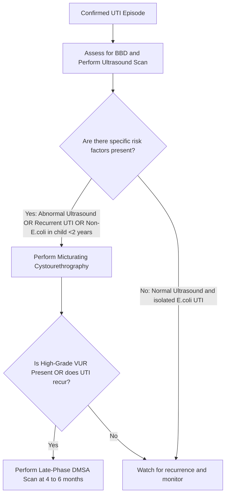
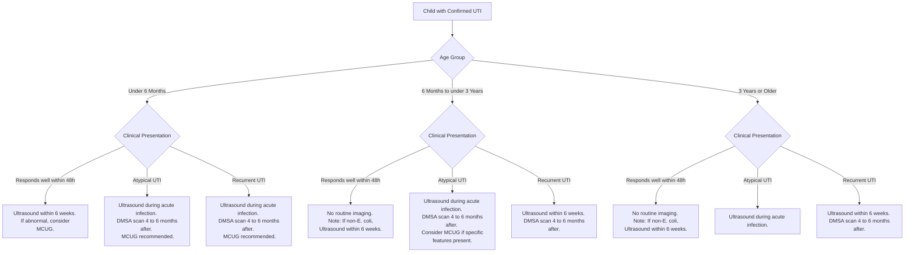

---
{"dg-publish":true,"uplink":"/nephrology/nephrology/","uptext":"Back to Index (🫘 Nephrology)","permalink":"/nephrology/urinary-tract-infection/","dgPassFrontmatter":true}
---

## Introduction And Epidemiology

- Urinary tract infection (UTI) is a very common bacterial infection during childhood.
- It affects approximately 1.7% of boys and 8.4% of girls before they reach the age of seven years.
- Delaying the diagnosis and treatment can cause irreversible damage to the developing kidneys.
- Long-term complications include renal scarring, hypertension, and renal insufficiency.

## Etiology And Risk Factors

- **Escherichia coli (E. coli)** is the most common causative organism, accounting for >70% of cases.
- Uncommon organisms include non-E. coli bacteria and fungi.
- Fungal UTIs are typically seen in immunocompromised patients, intensive care unit settings, prolonged antibiotic usage, and with indwelling catheters.
- Almost 50% of children with recurrent UTI and 10% presenting with a single UTI have an associated urological abnormality.

### Common Risk Factors

- Poor perineal hygiene and the unnecessary use of diapers.
- Congenital anomalies of the kidney and urinary tract (CAKUT), including vesicoureteral reflux (VUR), pelvic ureteric junction obstruction, and obstructive uropathy.
- Anatomic variations like phimosis in boys and vulval synechiae in girls.
- Bladder-bowel dysfunction (BBD) presenting as urinary urgency, frequency, voiding postponement, incontinence, and constipation.

## Clinical Presentation And Definitions

### Symptomatology By Age

- Infants often present with non-specific symptoms such as fever, vomiting, diarrhea, and poor weight gain.
- Older children typically present with fever, dysuria, urgency, frequency, and abdominal or flank pain.

### Standard Definitions

|Term|Definition|
|:--|:--|
|**Leukocyturia**|Presence of >=10 leukocytes/mm3 in fresh uncentrifuged sample, or >5 leukocytes/HPF in centrifuged sample.|
|**Bacteriuria**|Presence of one or more bacteria per oil immersion field in a freshly voided uncentrifuged sample.|
|**Acute Pyelonephritis**|Bacterial infection involving the upper urinary tract and kidney parenchyma.|
|**Cystitis**|Bacterial infection localizing to the bladder, with dysuria, frequency, urgency, and suprapubic tenderness.|
|**Febrile UTI**|Fever (temperature >= 38 C) with positive urine culture yielding a significant colony count of a single uropathogen.|
|**Recurrent UTI**|Two episodes of urinary tract infection during any time period in childhood.|

## Diagnostic Approach

### Sample Collection Strategies

- Urine samples should be processed within 30 minutes of collection to avoid contamination.
- Samples must never be collected using a urobag or minicom.

|Patient Group|Preferred Collection Method|
|:--|:--|
|**Toilet-trained children**|Midstream clean-catch method.|
|**Non-toilet-trained (Stable)**|Attempt clean-catch initially.|
|**Sick infants / Non-toilet-trained**|Simple urethral catheterization or suprapubic aspiration.|

### Laboratory Investigations

- **Screening Test:** A positive urine dipstick for leukocyte esterase and nitrite combination is suggested as a first-line screening tool for presumptive UTI.
- **Microscopy:** Urine microscopy for bacteriuria and leukocyturia in a freshly voided sample is an acceptable alternative to the dipstick.
- **Gold Standard:** Diagnosis is confirmed by isolating a single species of microorganism in a significant number from a properly collected culture.

### Significant Colony Counts For Diagnosis

- The Indian Society of Pediatric Nephrology (ISPN) has lowered the threshold for positive cultures to prevent missing true UTIs.

|Method of Collection|Significant Colony Count (CFU/mL)|
|:--|:--|
|**Suprapubic Aspiration**|Any number (>= 10^3).|
|**Urethral Catheterization**|>= 10^4.|
|**Midstream Clean-Catch**|>= 10^4 to 10^5.|

### Asymptomatic Bacteriuria

- Defined as significant bacteriuria without pyuria or clinical symptoms.
- It is often associated with nonvirulent E. coli colonization and is more common in girls.
- It should not be treated with antibiotics, and urine cultures are not indicated in asymptomatic children.

## Management Strategies

### Principles Of Antimicrobial Therapy

- Antibiotic therapy must be initiated promptly, preferably within 48 to 72 hours of fever onset to minimize kidney damage.
- The oral route is preferred over intravenous therapy for acute febrile UTI.
- Intravenous antibiotics are reserved for infants less than 2 months of age, severely ill patients, and those unable to tolerate oral intake.
- Change of initial therapy is only suggested for clinical treatment failure, regardless of in vitro sensitivity patterns.
- Routine repeat urine cultures are not required if the patient shows good clinical response.

### Treatment Duration And Regimens

|Clinical Scenario|Recommended Therapy Duration|Primary Antibiotic Choices|
|:--|:--|:--|
|**Acute Symptomatic Febrile UTI**|7 to 10 days.|3rd-generation cephalosporins or amoxycillin-clavulanic acid.|
|**Cystitis in Adolescents**|3 to 7 days.|1st-generation cephalosporins (cephalexin) or amoxycillin-clavulanic acid.|

### Approach Based On Severity

#### Uncomplicated First UTI

- Seen in children >3 months who are nontoxic and accepting oral feeds.
- Start oral antibiotics and evaluate clinical and pyuria improvement by 48 hours.

#### Complicated Or Atypical UTI

- Risk features include age <3 months, fever >39 C, lethargy, dehydration, renal angle tenderness, elevated creatinine, or non-E. coli infections.
- Requires hospitalization, intravenous fluids, and empirical intravenous antibiotics.
- Switch to oral antimicrobials after 48 hours once symptomatic improvement is achieved.

### Common Antimicrobial Dosages

|Antimicrobial Agent|Dose (mg/kg/day)|Remarks|
|:--|:--|:--|
|**Oral Cefixime**|10 in two divided doses|Good broad-spectrum agent.|
|**Oral Amoxicillin-Clavulanic Acid**|30-50 in two divided doses|Used for uncomplicated UTI.|
|**IV Amikacin**|10-15 in one to two divided doses|Once-a-day dosing is effective.|
|**IV Ceftriaxone**|75-100 in one to two divided doses|Safe and effective as monotherapy.|

## Imaging Guidelines

- The updated ISPN guidelines advise a less aggressive approach to imaging, aiming primarily to detect high-grade VUR.

|Imaging Modality|Indications|Clinical Value|
|:--|:--|:--|
|**Ultrasound Scan**|All patients following an episode of UTI.|Detects anomalies and provides clues for BBD without radiation.|
|**Micturating Cystourethrography (MCU)**|Abnormal ultrasound, recurrent UTI, or first UTI caused by non-E.coli in children <2 years.|Enables grading of VUR and provides anatomic delineation.|
|**Acute-Phase DMSA Scan**|Not recommended.|Low specificity for VUR and cannot differentiate acute infection from permanent scar.|
|**Late-Phase DMSA Scan**|Done 4 to 6 months post-UTI in recurrent UTI or high-grade VUR.|Gold standard for detecting permanent kidney scarring.|

## Prevention And Prophylaxis

### Antimicrobial Prophylaxis

- Routine antibiotic prophylaxis is not suggested for patients with a normal urinary tract and no bladder-bowel dysfunction.
- It is also not suggested for children with antenatally detected hydronephrosis awaiting evaluation.
- **Indications:** High-grade VUR (Grades 3-5), recurrent febrile UTI with BBD, and pending radiological evaluation after a first episode.
- **Preferred Agents:** Cotrimoxazole (1-2 mg/kg of trimethoprim) or nitrofurantoin (1-2 mg/kg) in children older than 3 months. Cephalexin is preferred for young infants under 3 months.
- **Discontinuation Criteria:** Prophylaxis can be stopped in children >2 years if they are toilet trained, have no BBD, and have had no febrile UTIs in the preceding year.

### Non-Antibiotic Interventions

- **Urotherapy:** Recommended for all children with BBD to prevent recurrence. It includes behavioral modifications, fluid intake optimization, and regular voiding habits.
- **Cranberry Products:** Can be considered for preventing recurrent UTI in children with a normal urinary tract.
- **Circumcision:** Considered a potential intervention to reduce the risk of recurrence in at-risk children.
- **Surgical Reimplantation:** Reserved for patients with high-grade VUR experiencing recurrent breakthrough febrile UTIs despite antibiotic prophylaxis.

## Follow-Up And Monitoring

- Ensure symptomatic improvement and documented normal urine analysis at the end of treatment.
- Monitor growth periodically.
- Blood pressure should be evaluated every 6 to 12 months.
- Assess renal function annually in children with a history of severe complicated UTI or recurrent episodes.
- Monitor for proteinuria after successful treatment, as it may indicate pyelonephritic renal scarring requiring medical intervention.
## Algorithm for MRCPCH based on NICE guidelines
