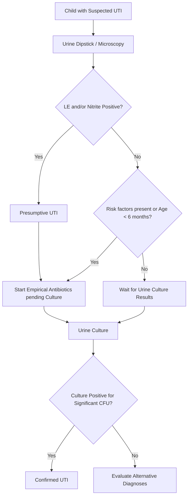

---
{"dg-publish":true,"uplink":"/nephrology/nephrology/","uptext":"Back to Index (🫘 Nephrology)","permalink":"/nephrology/urinary-tract-infection/","dgPassFrontmatter":true}
---

## Epidemiology and Etiology

- Urinary tract infection (UTI) is one of the most common bacterial infections in childhood, affecting 7-8% of girls and up to 2% of boys in the first decade of life.
- The prevalence varies with age: during the first 3 months of life, UTIs are most common in uncircumcised febrile males, with a prevalence of 20%, which is significantly higher than in circumcised males and females.
- Beyond 6 months of age and during infancy, the incidence becomes much higher in girls, with peaks correlating to toilet training and the onset of sexual activity.
- _Escherichia coli_ is the predominant uropathogen responsible for 85-90% of cystitis and pyelonephritis cases.
- Other Gram-negative bacteria causing UTI include _Klebsiella_, _Proteus_, _Pseudomonas_, _Enterobacter_, and _Citrobacter_ species.
- Gram-positive organisms such as _Enterococcus_ species and _Streptococcus agalactiae_ are frequent in neonates, while _Staphylococcus saprophyticus_ accounts for >15% of UTIs in sexually active female adolescents.
- Viral causes (like adenovirus types 11 and 21) are implicated in acute hemorrhagic cystitis, and fungal infections (like _Candida_) are seen in immunocompromised patients or following prolonged antimicrobial therapy.

## Predisposing Risk Factors

- Female anatomy and short urethra.
- Uncircumcised male status in the first year of life, allowing uropathogens to colonize the prepuce.
- Age younger than 1 year, attributed to an incompletely developed immune system.
- Bladder-bowel dysfunction (BBD) and constipation, which lead to incomplete bladder emptying, urinary retention, and stasis.
- Structural anomalies such as primary vesicoureteral reflux (VUR), posterior urethral valves, and obstructive uropathy.
- Neurogenic bladder, repeated catheterization, or presence of foreign bodies.

## Clinical Features

### Symptoms by Age Group

- **Neonates (< 2 months):** Clinical manifestations are non-specific and typically mimic sepsis, including fever, hypothermia, vomiting, irritability, lethargy, poor feeding, failure to thrive, and prolonged jaundice.
- **Infants and Toddlers (2–24 months):** Fever is frequently the only symptom, particularly a temperature $\ge 39^\circ \text{C}$ lasting more than 48 hours without an obvious focus. Other symptoms include vomiting, lethargy, abdominal pain, malodorous or cloudy urine, crying during micturition, and hematuria.
- **Older Children (> 2 years):** Symptoms are more localized and include fever, dysuria, urgency, urinary frequency, incontinence, suprapubic pain, cloudy urine, and loin/flank pain indicating acute pyelonephritis.

### Physical Examination Findings

|Clinical Finding|Likely Underlying Diagnosis|
|:--|:--|
|Palpable kidney or poor urinary stream|Obstructive uropathy, neurogenic bladder|
|Costovertebral angle/renal angle tenderness|Acute pyelonephritis|
|Palpable bladder or suprapubic tenderness|Obstructive uropathy, neurogenic bladder|
|Palpable fecolith in the abdomen|Constipation / Bladder-bowel dysfunction (BBD)|
|Sacral dimple, tuft of hair, lipoma|Occult meningomyelocele / Spinal dysraphism|
|Abnormal external genitalia (phimosis, labial adhesions)|Anatomic predisposition to UTI|

## Diagnosis

### Urine Collection Methods

- Clean-catch midstream urine is the preferred method for collection in toilet-trained children due to an acceptable contamination rate (around 5%) and cost-effectiveness.
- For non-toilet-trained, clinically stable children, a clean-catch should be attempted initially; if unsuccessful, catheterization or suprapubic aspiration (SPA) is recommended.
- In sick infants, urethral catheterization or SPA under ultrasound guidance are the preferred methods to avoid treatment delays.
- Urine collection via adhesive bags or nappy pads has unacceptably high contamination rates (30-80%) and must not be used for sending urine cultures, though they may occasionally be used for urinalysis.

### Urinalysis (Screening Tests)

- A urine dipstick combining leukocyte esterase and nitrite is the suggested first-line screening test, demonstrating good sensitivity (84%) and specificity (88%) when either is positive.
- Nitrite has excellent specificity (99%) but poor sensitivity (47%), often yielding false negatives in young infants due to frequent voiding and low dietary nitrate conversion times.
- Urine microscopy in a fresh uncentrifuged sample demonstrating leukocyturia ($\ge 10 \text{ leukocytes/mm}^3$) or bacteriuria can be used as an alternative screening tool.
- The absence of pyuria does not exclusively rule out a UTI, especially in infants or with atypical non-_E. coli_ infections.

### Urine Culture (Confirmatory)

- Diagnosis of UTI must be confirmed based on the significant growth of a single uropathogen in an appropriate clinical context.
- The significance of the colony-forming units (CFU) depends on the method of collection:
    - **Suprapubic Aspiration:** Growth of $\ge 10^3 \text{ CFU/mL}$ is diagnostic.
    - **Urethral Catheterization:** Growth of $\ge 10^4 \text{ CFU/mL}$ is significant.
    - **Clean-Catch Sample:** Growth of $\ge 10^4 \text{ to } 10^5 \text{ CFU/mL}$ of a single uropathogen is considered diagnostic.
- Asymptomatic bacteriuria is characterized by significant bacterial growth without clinical symptoms and does not require antibiotic treatment, as it resolves spontaneously and treatment does not prevent scarring.

### Diagnostic Algorithm



## Management

### General Principles and Route of Administration

- Antibiotic therapy must be initiated promptly, preferably within 48-72 hours of fever onset, to minimize the risk of permanent kidney scarring.
- Oral antibiotic therapy is equally as efficacious as initial intravenous therapy for febrile UTI and is preferred for all children.
- Intravenous (IV) antibiotics are strictly indicated for: (i) infants younger than 2 months of age, (ii) severely ill or toxic-appearing children (urosepsis), and (iii) patients unable to tolerate oral intake.
- When IV antibiotics are initiated, the treatment can be safely stepped down to oral therapy after 3-4 days once clinical improvement is noted.
- Routine repeat urine cultures after the completion of antibiotic therapy are not required unless symptoms fail to resolve despite 48-72 hours of appropriate antibiotics.
- Initial empirical therapy does not need to be altered based purely on in vitro sensitivity reports if the child is demonstrating excellent in vivo clinical resolution.

### Antimicrobial Selection and Duration

|Infection Type|Antibiotic Options|Recommended Duration|
|:--|:--|:--|
|**Acute Febrile UTI / Pyelonephritis** (Oral)|3rd-generation cephalosporins (Cefixime, Cefpodoxime), Amoxicillin-clavulanic acid|7 to 10 days|
|**Acute Febrile UTI / Pyelonephritis** (IV)|Ceftriaxone, Cefotaxime, Amikacin, Gentamicin, Ampicillin-sulbactam|7 to 10 days (3-4 days IV, remainder oral)|
|**Cystitis / Lower UTI** (Oral)|1st-generation cephalosporins (Cephalexin, Cefadroxil), Amoxicillin-clavulanic acid|3 to 7 days|

### Treatment Algorithm

```
graph TD;
    A[Confirmed Urinary Tract Infection] --> B{Clinical Presentation};
    B -- Cystitis / Lower UTI --> C[Oral Antibiotics for 3-7 days];
    B -- Febrile UTI / Pyelonephritis --> D{Age < 2 months, Sepsis, or Poor Oral Intake?};
    D -- No --> E[Oral Antibiotics];
    D -- Yes --> F[IV Antibiotics for 3-4 days];
    E --> G[Assess Clinical Response at 48-72h];
    F --> G;
    G -- Responding --> H[Step down to / Continue Oral Antibiotics Total 7-10 days];
    G -- Not Responding --> I[Repeat Urine Culture & Perform Renal USG to rule out complications];
```

## Imaging Following UTI

### Imaging Modalities and Indications

- **Ultrasonography (USG):** Recommended for all children following their first episode of UTI. It is non-invasive, radiation-free, and detects anatomical abnormalities, obstruction, and signs of BBD. It should be performed acutely if clinical improvement is absent at 48 hours to rule out pyonephrosis or abscess.
- **Micturating Cystourethrography (MCU):** The gold standard for diagnosing and grading VUR, PUV, and bladder anomalies. However, it is invasive and involves radiation. MCU is selectively indicated in children with:
    1. Abnormal USG findings (e.g., hydroureteronephrosis, bladder wall thickening).
    2. Recurrent UTIs.
    3. UTI caused by a non-_E. coli_ uropathogen in children less than 2 years of age.
- **Dimercaptosuccinic Acid (DMSA) Scintigraphy:**
    - _Acute-phase DMSA:_ Not recommended in the evaluation of febrile UTI, as it has low specificity for predicting high-grade VUR and does not alter acute management.
    - _Late-phase DMSA:_ Recommended 4 to 6 months after the acute infection solely for detecting permanent renal cortical scarring. It is restricted to children with recurrent UTIs or documented high-grade VUR (Grades III-V).

### Imaging Algorithm

```
graph TD;
    A[First Episode of UTI] --> B[Renal and Bladder Ultrasonography];
    B --> C{USG Abnormal?};
    C -- No --> D{Age < 2 yrs AND Non-E.coli UTI?};
    D -- No --> E[Routine Surveillance / Follow-up];
    D -- Yes --> F[Micturating Cystourethrography MCU];
    C -- Yes --> F;
    F --> G{High-Grade VUR III-V Detected OR Recurrent UTI?};
    G -- Yes --> H[Late-Phase DMSA Scintigraphy at 4-6 months];
    G -- No --> E;
    I[Recurrent UTI Episode] --> F;
```

## Prevention of Recurrent UTI

### Antibiotic Prophylaxis

- Antibiotic prophylaxis is strongly not recommended for children with a normal urinary tract and absence of BBD, as it does not prevent scarring but increases antimicrobial resistance.
- It is not recommended for the prevention of symptomatic UTI in infants with isolated antenatally detected hydronephrosis awaiting evaluation.
- Prophylaxis is indicated for the prevention of recurrent febrile UTI in patients with high-grade primary VUR (Grades III-V).
- It may be considered in preference to surveillance for patients presenting with recurrent febrile UTI and BBD, regardless of the presence of VUR.
- **Drugs and Dosages:** Cotrimoxazole (2 mg/kg/day of trimethoprim) or Nitrofurantoin (1-2 mg/kg/day) as a single bedtime dose are the first-line agents in children older than 3 months. Cephalexin (10-12.5 mg/kg/day) or Cefadroxil (5 mg/kg/day) are used in early infancy to prevent interference with bilirubin metabolism.
- **Discontinuation:** Prophylaxis can be stopped in children older than 2 years of age who meet all three criteria: (i) successfully toilet-trained, (ii) complete absence of BBD, and (iii) free of febrile UTI for the preceding 1 year.

### Other Preventive Strategies and Surgical Intervention

- **Urotherapy for Bladder-Bowel Dysfunction (BBD):** All toilet-trained children with UTI must be evaluated for BBD. BBD significantly increases the risk of UTI recurrence and delays VUR resolution. Urotherapy (hydration, timed voiding, optimal posture, treatment of constipation) is the first-line and highly recommended preventive strategy for all BBD patients.
- **Circumcision:** Circumcision significantly reduces the relative risk of UTI and is suggested as an intervention for at-risk male infants (those with high-grade VUR or severe recurrent UTIs).
- **Cranberry Products:** Can be used to prevent recurrences in children with recurrent UTI and normal urinary tracts (anti-adhesive effect via proanthocyanidins), though compliance may be limited by taste and volume.
- **Surgical VUR Correction (Reimplantation/Endoscopic):** Medical management with prophylaxis is the first line for high-grade VUR. Surgical reimplantation is strictly reserved for patients with recurrent breakthrough febrile UTIs despite maximal antibiotic prophylaxis and optimized BBD management, or based on parental preference to avoid long-term antibiotics. Endoscopic bulking agent injection is an alternative but carries a lower success rate.