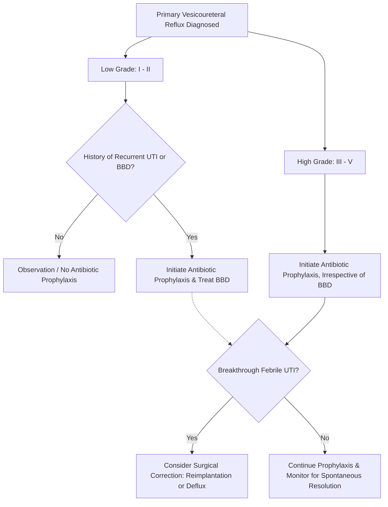

---
{"dg-publish":true,"uplink":"/nephrology/nephrology/","uptext":"Back to Index (🫘 Nephrology)","permalink":"/nephrology/vesicoureteral-reflux-vur/","dgPassFrontmatter":true}
---

### Definition and Pathophysiology

- Vesicoureteral reflux (VUR) is the retrograde flow of urine from the bladder into the ureters and renal pelvis at rest or during micturition.
- The normal ureterovesical junction acts as a one-way flap-valve due to the oblique insertion of the ureter into the bladder musculature and an adequate length of the submucosal ureteral tunnel.
- VUR occurs when the submucosal tunnel is congenitally short or absent, leading to valvular incompetence.
- The condition predisposes the kidney to pyelonephritis by facilitating the ascent of colonized bladder bacteria into the upper urinary tract, which can trigger severe inflammation and subsequent renal scarring (reflux nephropathy).

### Classification

|Type of VUR|Pathogenesis|Associated Conditions|
|:--|:--|:--|
|**Primary VUR**|Congenital incompetence of the ureterovesical junction valvular mechanism.|Familial inheritance, multi-cystic dysplastic kidney, ureteral duplication.|
|**Secondary VUR**|Increased intravesical pressure overcoming a competent valve, or inflammatory disruption.|Posterior urethral valves (PUV), neurogenic bladder, severe bacterial cystitis, bladder bowel dysfunction (BBD).|

### Grading of VUR

- The severity of VUR is evaluated and graded based on the International Reflux Study classification using a contrast voiding cystourethrogram (VCUG).

|Grade|Radiographic Appearance on VCUG|
|:--|:--|
|**Grade I**|Reflux solely into a non-dilated ureter.|
|**Grade II**|Reflux into the upper collecting system (renal pelvis and calyces) without any dilation.|
|**Grade III**|Reflux into a dilated ureter and/or mild-to-moderate blunting of the calyceal fornices.|
|**Grade IV**|Reflux into a grossly dilated and moderately tortuous ureter, with complete obliteration of the sharp angles of the calyceal fornices.|
|**Grade V**|Massive reflux with gross dilation and tortuosity of the ureter, renal pelvis, and calyces, accompanied by loss of papillary impressions.|

### Clinical Presentation and Risk Factors

- VUR is most frequently diagnosed in young children following an episode of a febrile urinary tract infection (UTI).
- It may also be identified postnatally during the routine evaluation of antenatally detected hydronephrosis.
- VUR frequently coexists with Bladder Bowel Dysfunction (BBD), a condition characterized by voiding postponement, constipation, and uninhibited bladder contractions. The presence of BBD doubles the risk of recurrent UTIs and delays the spontaneous resolution of VUR.
- VUR is a highly familial trait, with an estimated 32% of siblings of an index patient also having the condition, suggesting an autosomal dominant pattern with variable penetrance.

### Diagnostic Evaluation

- **Renal and Bladder Ultrasound (USG):** Recommended after the first episode of UTI in all children to assess for hydroureteronephrosis, bladder wall thickness, and post-void residual urine (indicating BBD). USG alone has poor sensitivity for detecting VUR.
- **Voiding Cystourethrogram (VCUG):** The gold standard for diagnosing and grading VUR. Current guidelines recommend VCUG in children if they have a recurrent UTI, an abnormal ultrasound scan, or if a non-_E. coli_ UTI occurs in a child under 2 years of age.
- **Dimercaptosuccinic Acid (DMSA) Scintigraphy:** The gold standard for identifying reflux nephropathy and permanent renal scarring. A late-phase DMSA scan should be performed 4–6 months following a UTI in patients with recurrent infections or documented high-grade VUR.

### Management

- **Observation and Medical Therapy:** Primary VUR often resolves spontaneously as the child grows. The resolution rate is 70–90% for grades I–III and 10–35% for grades IV–V. Younger age at diagnosis and unilateral involvement favor spontaneous resolution.
- **Antimicrobial Prophylaxis:** The primary goal is to maintain sterile urine to prevent pyelonephritis while awaiting spontaneous resolution.
    - Current guidelines strongly suggest prophylaxis for children with high-grade (Grades III–V) VUR.
    - Prophylaxis is generally not recommended for low-grade VUR without BBD, but may be considered in infants or in patients with recurrent UTIs accompanied by BBD.
    - First-line agents include oral Cotrimoxazole or Nitrofurantoin (in children > 3 months) or Cephalexin (in infants < 3 months) administered as a single bedtime dose.
    - Prophylaxis may be discontinued if the child is older than 2 years, is fully toilet trained, has no BBD, and has been free of febrile UTIs for at least 1 year.
- **Surgical Correction:** Indicated for patients with high-grade VUR who suffer recurrent breakthrough febrile UTIs despite compliant antibiotic prophylaxis, patients with deteriorating renal function, or based on parental preference.
    - **Open Ureteral Reimplantation:** The gold standard surgical procedure (e.g., Cohen cross-trigonal reimplantation) creating a new, longer submucosal tunnel. It boasts a success rate of 95–98%.
    - **Endoscopic Treatment:** A minimally invasive alternative involving the subureteral injection of a bulking agent (dextranomer/hyaluronic acid copolymer, Deflux) to coapt the ureteral orifice. While carrying a lower success rate (70–80%) compared to open surgery, it is performed as a day procedure.

### Complications and Reflux Nephropathy

- Intrarenal reflux of infected urine causes intense inflammation leading to irreversible tubulointerstitial fibrosis and cortical scarring, classically at the compound papillae located at the upper and lower poles of the kidney.
- **Hypertension:** Develops in 10–30% of children and young adults with established renal scarring due to segmental renal ischemia and localized renin hypersecretion.
- **Chronic Kidney Disease (CKD):** Severe, bilateral congenital reflux nephropathy or acquired scarring leads to adaptive hyperfiltration in remaining nephrons, proteinuria, glomerulosclerosis, and ultimately accounts for 6–17% of pediatric end-stage kidney disease.