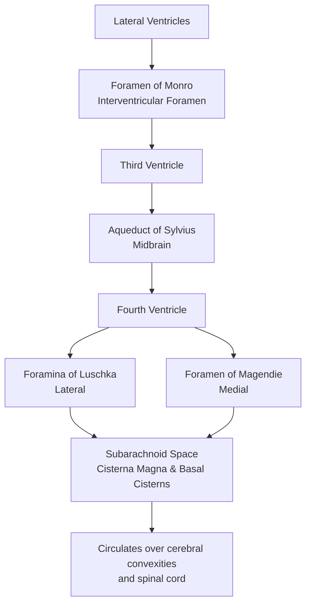

---
{"dg-publish":true,"uplink":"/neurology/neurology/","uptext":"Back to Index (Neurology)","permalink":"/neurology/hydrocephalus/","dgPassFrontmatter":true}
---

## NORMAL CSF CIRCULATION & AQUEDUCTAL STENOSIS 
### A. Normal CSF Circulation in Newborns
In newborns, cerebrospinal fluid (CSF) dynamics differ slightly from adults due to open fontanelles and immature absorption pathways.

**1. Production**
* **Site:** Primarily by the **Choroid Plexus** (tufts of capillaries covered by specialized ependymal cells) located in the Lateral, 3rd, and 4th ventricles.
* **Rate:** Approx 20–25 ml/kg/day (roughly 0.35 ml/min).
* **Total Volume:** Newborn CSF volume is small (**~50 ml**) compared to adults (~150 ml).

**2. Circulation Pathway (The "Third Circulation")**
Flows via bulk flow along a pressure gradient (pulsatile flow driven by arterial, respiratory, and venous phases).
<!-- htmlmin:ignore -->

<!-- /htmlmin:ignore -->
**3. Absorption**
* **Primary Mechanism:** Absorption into the Venous Sinuses (primarily Superior Sagittal Sinus) via **Arachnoid Granulations** (villi).
* **Newborn Specifics:** Arachnoid granulations are rudimentary at birth. Significant absorption occurs via:
    * Extracellular spaces of nerve sheaths.
    * Cerebral capillaries.
    * Lymphatic channels (extracranial).
### B. Changes in Aqueductal Stenosis
Aqueductal stenosis (AS) is the narrowing of the Aqueduct of Sylvius, the critical bottleneck between the 3rd and 4th ventricles.

**1. Anatomical Disruption**
* The aqueduct is the narrowest point of the ventricular system (approx 1 mm diameter).
* Stenosis creates a mechanical block preventing CSF exit from the 3rd ventricle.

**2. Hydrodynamic Changes (Upstream vs. Downstream)**
* **Upstream Dilation:**
    * **Lateral Ventricles:** Massive dilation due to accumulating CSF.
    * **3rd Ventricle:** Becomes ballooned/dilated.
    * **Result:** **"Bi-ventricular"** or **"Tri-ventricular"** hydrocephalus (depending on nomenclature, strictly it affects Lat + 3rd).
* **Downstream Spared:**
    * **4th Ventricle:** Remains **normal or small** size (isolated from the pressure).
    * **Posterior Fossa:** Normal size (unlike Dandy-Walker where it is large).

**3. Parenchymal Effects**
* **Cortical Mantle:** Thins rapidly due to expansion of lateral ventricles against the skull.
* **Corpus Callosum:** Stretched and thinned.
* **Tectal Plate Compression:** Dilated suprapineal recess pushes on the midbrain tectum $\rightarrow$ Parinaud’s phenomenon (Sunsetting eyes - inability to gaze upward).

## ETIOLOGY & PATHOPHYSIOLOGY OF HYDROCEPHALUS 
### A. Etiology of Hydrocephalus
Classified broadly into Non-Communicating (Obstructive) and Communicating (Non-obstructive).

#### 1. Non-Communicating (Obstructive)
*Blockage within the ventricular system prevents CSF from reaching the Subarachnoid Space.*

* **Congenital:**
    * **Aqueductal Stenosis:**
        * *X-linked Hydrocephalus (L1CAM mutation):* Stenosis + adducted thumbs.
        * *Congenital infection (TORCH):* Toxoplasmosis/CMV causing ependymitis/gliosis.
    * **Dandy-Walker Malformation:** Cystic dilation of 4th ventricle + Vermian agenesis + Large posterior fossa.
    * **Chiari II Malformation:** Associated with Myelomeningocele; displacement of cerebellar tonsils blocks CSF exit at foramen magnum/4th ventricle.
    * **Neural Tube Defects:** Encephalocele.

* **Acquired:**
    * **Tumors:** Supratentorial (compressing 3rd vent) or Infratentorial (Medulloblastoma, Ependymoma, Astrocytoma compressing 4th vent).
    * **Intraventricular Hemorrhage (IVH):** Acute clot obstructing the aqueduct.
    * **Ventriculitis:** Pyogenic pus organizing and blocking foramina.

#### 2. Communicating (Non-Obstructive)
*CSF exits ventricles but absorption is blocked at arachnoid granulations or flow blocked in SAS.*

* **Post-Infectious:** Tuberculous Meningitis (basal arachnoiditis), bacterial meningitis (fibrosis of granulations).
* **Post-Hemorrhagic:** IVH (Preterms), Subarachnoid Hemorrhage. Blood products clog arachnoid villi and cause inflammatory fibrosis.
* **Hyper-secretory (Rare):** Choroid Plexus Papilloma (Production exceeds maximal absorption capacity).
### B. Pathophysiology of Hydrocephalus

**1. Fundamental Imbalance**
Hydrocephalus results from a disturbance in CSF dynamics where:
$$\text{Formation} > \text{Absorption}$$
*(Except in rare hydrocephalus ex-vacuo which is compensatory to brain atrophy).*

**2. Phase I: Acute Compensation**
* **CSF Displacement:** CSF is shunted to the spinal subarachnoid space (if communicating).
* **Venous Compression:** Intracranial pressure (ICP) rises $\rightarrow$ venous sinuses compress $\rightarrow$ attempt to increase absorption.
* **Open Sutures:** In infants, cranial sutures split, and fontanelles bulge to increase intracranial volume and buffer pressure.

**3. Phase II: Parenchymal Injury (The Vicious Cycle)**
* **Transependymal Flow:** As ventricular pressure rises, the ependymal lining stretches and tears. CSF is forced into the periventricular white matter (Interstial Edema).
* **White Matter Damage:**
    * Edema compresses periventricular capillaries.
    * Result: **Ischemia** and oligemia of white matter.
    * Axonal stretching and myelin disruption.
* **Grey Matter Spared:** Cortical grey matter is relatively preserved until late stages.

**4. Law of Laplace**
$$T = P \times R$$
*(Wall Tension = Pressure $\times$ Radius)*
* As ventricles dilate (Radius increases), the tension on the ventricular wall increases even if pressure normalizes slightly.
* This tension maintains the dilation (**Normal Pressure Hydrocephalus mechanism**).

**5. Clinical Pathophysiology Correlations**
* **Macewen Sign:** Cracked pot sound on percussion due to separated sutures.
* **Sunsetting Sign:** Pressure on the midbrain tectum (superior colliculus).
* **Pyramidal Signs:** Stretching of corticospinal tracts (fibers to legs run closest to ventricles) $\rightarrow$ Spasticity/Brisk reflexes, primarily in lower limbs.