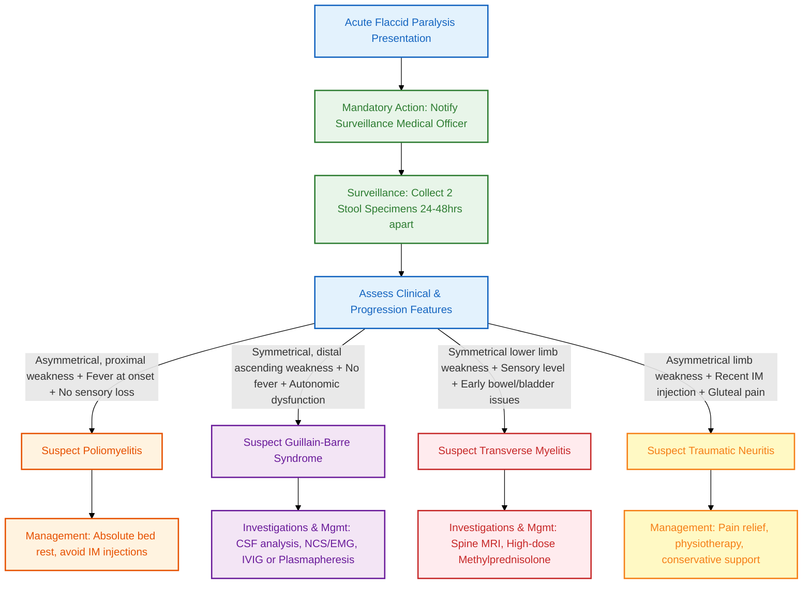

---
{"dg-publish":true,"uplink":"/neuromuscular/neuromuscular-system/","uptext":"Back to Index (💪 Neuromuscular system)","permalink":"/neuromuscular/acute-flaccid-paralysis/","dgPassFrontmatter":true}
---

## Definition And Clinical Syndrome

- [[Neuromuscular/Acute Flaccid Paralysis\|Acute flaccid paralysis]] (AFP) is a clinical syndrome characterized by the rapid onset of weakness, progressing to maximum severity within several days to weeks.
- The term 'flaccid' refers to the absence of spasticity or other upper motor neuron signs.
- Under the Global Polio Eradication Initiative, AFP is defined as any case of flaccid weakness in children less than 15 years old, or any paralytic illness at any age when polio is suspected.
## WHO Case Definition
- **Any child under 15 years of age** with **acute onset** of focal weakness or paralysis characterized as **flaccid** (reduced muscle tone), including those in whom a clinician suspects poliomyelitis.
- **Any person of any age** in whom **poliomyelitis is suspected** by a clinician.
## Etiology And Anatomical Localization

Disorders presenting as AFP can localize to various points along the neuroaxis, from the anterior horn cell to the muscle.

### Common Causes Of [[Neuromuscular/Acute Flaccid Paralysis\|Acute Flaccid Paralysis]]

|Anatomical Level|Examples Of Disorders|
|:--|:--|
|**Muscle Disorders**|Inflammatory myopathy, periodic paralysis, hypokalemia, severe systemic infections.|
|**Neuromuscular Junction**|[[Neuromuscular/Myasthenia Gravis\|Myasthenia gravis]], botulism, Eaton-Lambert syndrome.|
|**Peripheral Neuropathies**|[[Neuromuscular/Guillain-Barré Syndrome\|Guillain-Barré syndrome]] (GBS), traumatic neuritis, post-diphtheritic neuropathy, porphyria, vasculitis, Bell's palsy.|
|**Anterior Horn Cell**|Poliomyelitis, non-polio enteroviruses.|
|**Spinal Cord Disease**|Transverse myelitis, spinal cord compression, spinal trauma.|

## Differential Diagnosis Of [[Neuromuscular/Acute Flaccid Paralysis\|Acute Flaccid Paralysis]]

Differentiating the major causes of AFP is critical for management and surveillance.

### Distinguishing Clinical And Laboratory Features

|Feature|Poliomyelitis|[[Neuromuscular/Guillain-Barré Syndrome\|Guillain-Barré Syndrome]]|Transverse Myelitis|Traumatic Neuritis|
|:--|:--|:--|:--|:--|
|**Progression**|24-48 hours onset to full paralysis|Hours to 10 days|Hours to 4 days|Hours to 4 days|
|**Fever At Onset**|High, always present at onset; gone the following day|Not common|Rarely present|Commonly present before, during and after paralysis|
|**Symmetry**|Acute, asymmetrical, proximal|Acute, symmetrical, distal|Acute, lower limbs, symmetrical|Acute, asymmetric limb|
|**Sensation**|Severe myalgia and backache, no sensory changes|Cramps, tingling, hypoanaesthesia of palms/soles|Anaesthesia of lower limbs with sensory level|Pain in gluteal region|
|**Deep Tendon Reflexes**|Decreased or absent|Absent|Absent early; hyper-reflexia late|Decreased or absent|
|**Bowel/Bladder**|Absent|Transient, late; due to autonomic dysfunction|Present, early|Absent|
|**Cerebrospinal Fluid**|Lymphocytic pleocytosis; normal or high protein|Albuminocytologic dissociation|Variable|Normal|

## Algorithmic Approach

## Key Pathologies Causing [[Neuromuscular/Acute Flaccid Paralysis\|Acute Flaccid Paralysis]]

### Poliomyelitis

- **Clinical Presentation**: Sudden onset of asymmetrical paralysis with muscle pain, predominantly involving proximal muscle groups. Febrile illness occurs just prior to paralysis.
- **Examination**: No sensory loss; hypotonia and areflexia in the involved groups.
- **Management**: Absolute bed rest and supportive care during the acute phase; intramuscular injections must be avoided. Later rehabilitation utilizes calipers and braces to promote ambulation.
- **Prevention**: Full immunisation required 3-4 weeks even after a confirmed attack.

### [[Neuromuscular/Guillain-Barré Syndrome\|Guillain-Barré Syndrome]] (GBS)

- **Pathophysiology**: Acquired post-infectious demyelinating or axonal disease of the peripheral nervous system. _Campylobacter jejuni_ is an important preceding infection.
- **Subtypes**: Acute Inflammatory Demyelinating Polyneuropathy (AIDP), Acute Motor Axonal Polyneuropathy (AMAN), Acute Motor and Sensory Axonal Neuropathy (AMSAN), and Miller-Fisher syndrome.
- **Clinical Presentation**: Ascending, bilaterally symmetrical flaccid weakness, often accompanied by bilateral facial nerve weakness and autonomic dysfunction. Pain and muscle tenderness are common at onset.
- **Investigations**: Cerebrospinal fluid demonstrates albuminocytologic dissociation (elevated protein with normal cell count). Electrophysiological studies (NCS/EMG) confirm demyelinating or axonal nerve conduction slowing.
- **Management**: Intravenous Immunoglobulin (IVIG, 2 g/kg over 5 days) or plasmapheresis. Close observation for respiratory muscle involvement requiring ventilatory support. Corticosteroids offer no benefit and may be detrimental.

### Transverse Myelitis

- **Clinical Presentation**: Abrupt onset of symmetrical paraparesis, sensory disturbances with a distinct sensory level, and marked bladder and bowel involvement.
- **Evolution**: Flaccidity may transition to spasticity, and hyporeflexia may be replaced by hyperreflexia after several weeks.
- **Investigations**: MRI of the spine confirms diagnosis, typically showing cord enlargement and increased signal on T2-weighted sequences with gadolinium enhancement.
- **Management**: High-dose methylprednisolone (1 g/1.73 m² or 30 mg/kg) started within 5-16 days of onset, given daily for 5 days.

### Traumatic Neuritis

- **Clinical Presentation**: History of intramuscular injection 1 to 5 days prior to the onset of weakness. Presents with local pain and tenderness, followed by asymmetric weakness in the injected limb.
- **Examination**: Knee reflex may be preserved while the ankle reflex is decreased or absent. Foot drop commonly develops.
- **Management**: Pain relief, physiotherapy, and conservative support. Usually recovers within 3-9 months.

## [[Neuromuscular/Acute Flaccid Paralysis\|Acute Flaccid Paralysis]] Surveillance Strategy

- [[Infectious Diseases/AFP surveillance\|AFP surveillance]] is the chief strategy to screen for circulating wild poliovirus.
- **Notification**: All patients with AFP within the last 6 months must be reported to the Surveillance Medical Officer. Cases are investigated within 48 hours of notification.

### Stool Specimen Collection Protocol

- **Quantity**: Two stool specimens must be collected. Each specimen should be approximately 8 grams.
- **Timing**: Specimens must be collected 24-48 hours apart, ideally within 14 days of paralysis onset, though collections up to 60 days are accepted.
- **Transport**: Specimens must be transported under strictly maintained [[Misc/Cold Chain\|cold chain]] conditions.
- **Laboratory Isolation**: Human [[Hematology/Rhabdomyosarcoma\|rhabdomyosarcoma]] (RD) cell lines favour enterovirus growth, whilst L20B cell lines exclusively favour polioviruses. Isolates undergo intratypic differentiation and genetic sequencing.

### Virologic Classification And Quality Indicators

- **Classification**: A case is confirmed as polio only if wild poliovirus is isolated from the stool specimen. Cases without wild poliovirus isolation but with inadequate specimens and residual weakness at 60 days undergo expert review for classification as "polio compatible" or "discarded".
- **Surveillance Sensitivity**: The non-polio AFP rate must be equal to or greater than 1 case per 100,000 children under 15 years per year. Additionally, an adequate surveillance program requires that at least 80% of AFP cases have two stool samples taken within two weeks of paralysis onset.

## Role Of Electrophysiological Studies

- Nerve Conduction Studies (NCS) and Electromyography (EMG) play a pivotal role in distinguishing true motor unit diseases from central or structural etiologies.
- They differentiate anterior horn cell diseases, such as non-polio enteroviral infections (showing neuropathic denervation patterns), from neuropathies like [[Neuromuscular/Guillain-Barré Syndrome\|Guillain-Barré syndrome]] (showing demyelinating or axonal disruption patterns).