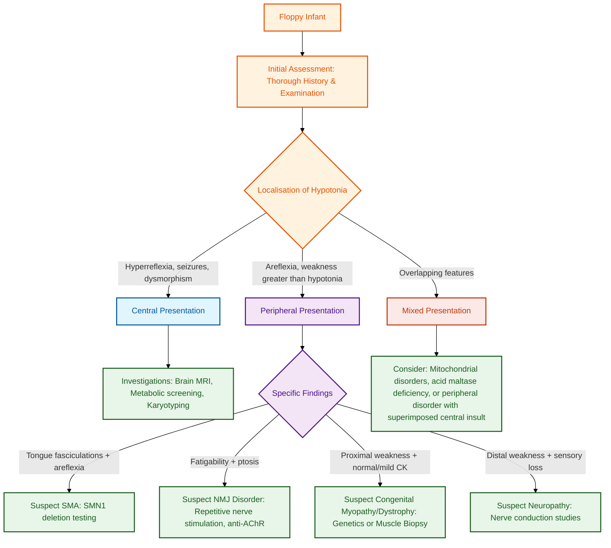

---
{"dg-publish":true,"uplink":"/neuromuscular/neuromuscular-system/","uptext":"Back to Index (💪 Neuromuscular system)","permalink":"/neuromuscular/approach-to-a-floppy-infant/","dgPassFrontmatter":true}
---

## Definition And Concept

Floppiness or hypotonia is characterized by bizarre or unusual postures (such as a frog position), diminished resistance of joints to passive movement, increased range of movement around joints, paucity of spontaneous movements, and motor delay. Hypotonia can be central (proximal to the anterior horn cell), peripheral (involving the motor unit: anterior horn cell, peripheral nerve, neuromuscular junction, or muscle), or mixed. Determining whether hypotonia is associated with actual muscle weakness, wasting, fasciculations, altered deep tendon reflexes, sensory changes, or fatigability is the key to accurate localization.

## Etiology

Floppiness can stem from a lesion at any level of the nervous system. Central causes of hypotonia must always be excluded first.

### Causes Of Floppiness In Neonates

|Status|Associated Aetiologies|
|:--|:--|
|**Well Neonate**|SMA (type 1), Congenital myopathies, Congenital muscular dystrophy, Down syndrome, Hypothyroidism, Peripheral neuropathies|
|**Sick Neonate**|Intraventricular haemorrhage, Birth asphyxia, Sepsis/meningitis, Bilirubin encephalopathy, Maternal diazepam/magnesium sulphate, Neurometabolic disorders (nonketotic hyperglycinemia)|

### Causes Of Floppiness In Infancy And Childhood

|Cause|Disease Course|Primary Investigations|
|:--|:--|:--|
|SMA I, II, III|Progressive (SMA I); Static (SMA II, III)|5q exon 7 SMN gene deletion; EMG neuropathic|
|Metabolic Disorders|Variable|Metabolic workup|
|Congenital Muscular Dystrophy|Static to slowly progressive|EMG, CPK, muscle biopsy, immunohistochemistry, brain imaging|
|Congenital Myopathies|Static to slowly progressive|EMG, CPK, muscle biopsy, immunohistochemistry, brain imaging|
|Peripheral Neuropathies|Evolving course, distal distribution, sensory involvement|Nerve conductions, genetic studies|
|Hypotonic [[Neurology/Cerebral Palsy\|Cerebral Palsy]]|Non-motor domains affected; evolving course|Clinical history and neuroimaging|

## Stepwise Clinical Approach
### Algorithm

### Step 1: History

- **Onset And Progression:** Determine the age at onset, mode of onset, presenting complaints, and rapidity of progress.
- **Antenatal History:** Decreased fetal movements and polyhydramnios suggest intrauterine swallowing difficulty, providing a clue for SMA.
- **Perinatal History:** Evaluate birth weight, birth asphyxia, and perinatal sepsis.
- **Developmental History:** Delay of motor milestones with normal intellectual development strongly suggests a motor unit defect.
- **Feeding And Respiratory Issues:** Recurrent pneumonias and feeding problems indicate potential neuromuscular bulbar/respiratory weakness.
- **Family History:** Ascertain the pattern of genetic inheritance.

### Step 2: Examination

- **Posture And Alertness:** Frog-like posture in the supine position indicates severe hypotonia. SMA type 1 infants remain remarkably alert despite profound weakness.
- **Axillary Suspension:** A floppy infant will slip through the examiner's hands when held erect from the axilla.
- **Weakness Proportion:** Weakness proportionate to hypotonia points to a peripheral muscle/nerve aetiology. Weakness disproportionate to hypotonia points to CNS, systemic, or metabolic illness.
- **Fasciculations:** Tongue fasciculations while the tongue remains within the oral cavity suggest a neuropathic origin, classically SMA.
- **Reflexes:** Brisk, elicitable deep tendon reflexes suggest an upper motor neuron cause (e.g., hypotonic [[Neurology/Cerebral Palsy\|cerebral palsy]]).
- **Respiratory Pattern:** Document intercostal or diaphragmatic weakness. Paradoxical breathing and a bell-shaped chest are more prominent in SMA than in congenital muscular dystrophy.
- **Facial Dysmorphism:** Facial muscle weakness is common in [[Neuromuscular/Congenital Myopathy\|Congenital Myopathy]] and myotonic dystrophy. Always evaluate the mother for myotonia if congenital myotonic dystrophy is suspected.

### Step 3: Localisation Of Hypotonia

#### Differentiating Central Versus Peripheral Hypotonia

|Feature|Central Hypotonia|Peripheral Hypotonia|
|:--|:--|:--|
|**Level of Lesion**|Proximal to anterior horn cell|Motor unit|
|**Deep Tendon Reflexes**|Normal or brisk|Depressed or absent|
|**Weakness Degree**|Mild (+)|Severe (++)|
|**Antigravity Movements**|Present|Absent|
|**Contractures**|Absent|Usually present|
|**Seizures/Dysmorphism**|May be present|Absent|

#### Differentiating Muscle Versus Nerve Disease

|Feature|Muscle Disease|Nerve Disease|
|:--|:--|:--|
|**Wasting**|Less|More|
|**Tendon Reflexes**|Decreased or normal|Areflexia|
|**Fasciculations**|Absent|Present|
|**Distribution of Weakness**|Proximal|Distal|
|**Sensory Abnormalities**|Absent|Present|

### Step 4: Targeted Investigations

- **Serum Creatine Kinase (CK):** Markedly elevated in Duchenne/Becker muscular dystrophy. Normal or mildly elevated in congenital myopathies and SMA.
- **Electrophysiology (EMG/NCS):** Demonstrates neuropathic patterns in SMA, myopathic patterns in myopathies, and decremental response in myasthenia syndromes.
- **Muscle Biopsy:** Identifies dystrophic changes in congenital muscular dystrophy, and specific changes (nemaline rods, central cores, central nuclei) in congenital myopathies.
- **Genetic Studies:** SMN1 deletion testing for SMA; targeted next-generation sequencing panels for myopathies and dystrophies.
- **Neuroimaging:** Brain MRI is indicated to rule out central causes.
- **Metabolic Screen:** Include lactate, pyruvate, acylcarnitine profile, and very-long-chain fatty acids if metabolic errors are suspected.

## Diagnostic Algorithm

1. **Initial Assessment:** Perform a thorough history and examination to localise the lesion as central versus peripheral.
2. **Central Presentation:** If hyperreflexia, seizures, or dysmorphism are present, proceed with brain MRI, metabolic screening, and [[Genetics/Karyotyping\|karyotyping]].
3. **Peripheral Presentation:** If peripheral signs (areflexia, weakness greater than hypotonia) are present:
    - **Tongue fasciculations + areflexia:** Perform SMA genetic testing for SMN1 deletion.
    - **Fatigability + ptosis:** Perform neuromuscular junction studies (repetitive nerve stimulation, anti-AChR antibodies).
    - **Proximal weakness + normal/mild CK:** Suspect [[Neuromuscular/Congenital Myopathy\|Congenital Myopathy]] or muscular dystrophy; proceed with genetics or muscle biopsy.
    - **Distal weakness + sensory loss:** Perform nerve conduction studies to evaluate for hereditary or acquired neuropathy.
4. **Mixed Presentation:** Consider mitochondrial disorders, acid maltase deficiency, or a peripheral disorder with superimposed central hypoxic insult.

## High-Yield Nuances

- Central causes of hypotonia (asphyxia, bilirubinemia, acute illness) are far more common and must be excluded rapidly.
- Alertness with profound weakness and paradoxical breathing strongly suggest SMA type 1.
- Congenital myopathies frequently manifest with facial and bulbar weakness but strictly lack fasciculations.
- The presence of contractures at birth (arthrogryposis) implies in-utero onset and points towards severe congenital muscular dystrophy or specific congenital myopathies.

## Management Principles

- **Disease-Modifying Therapies:** Early definitive diagnosis allows the initiation of transformational therapies (e.g., nusinersen, risdiplam, or onasemnogene abeparvovec for SMA).
- **Supportive Care:** Multidisciplinary management involving respiratory support (noninvasive ventilation, cough assist), nutritional support (gastrostomy), and orthopaedic care (contracture prevention, scoliosis management) is mandatory.
- **Genetic Counselling:** Since most neuromuscular causes of the floppy infant are hereditary (predominantly autosomal recessive), genetic counselling, carrier testing, and prenatal diagnosis are paramount.