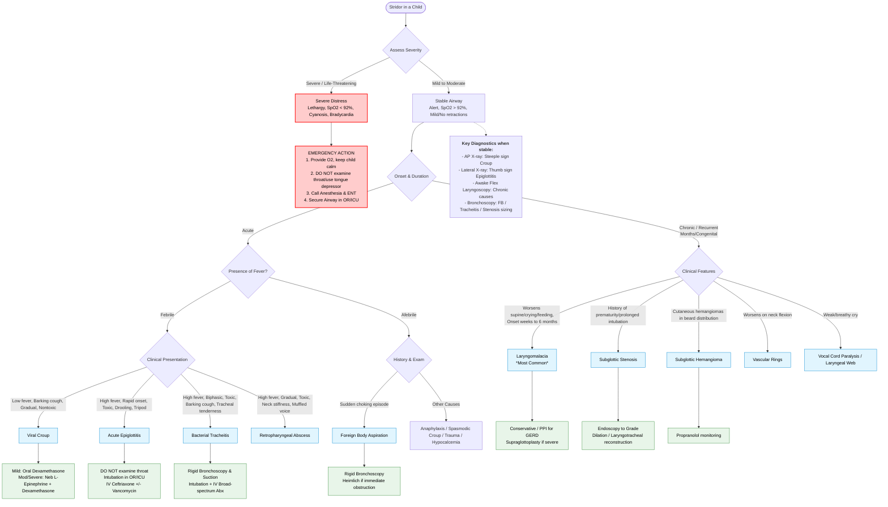

---
{"dg-publish":true,"uplink":"/respiratory/respiratory-system/","uptext":"Back to Index (🫁Respiratory System)","permalink":"/respiratory/approach-to-stridor/","dgPassFrontmatter":true}
---

## Algorithmic Approach To Stridor

## Definition And Pathophysiology

- Indicates acute or chronic upper respiratory tract obstruction.
- Characterized by high-pitched, harsh, or metallic/brassy sounds.
- Produced by turbulent airflow across narrowed segments of respiratory tract.
- Airway resistance inversely proportional to fourth power of airway radius.
- Minor reductions in cross-sectional area exponentially increase airway resistance and work of breathing.
- Anatomic factors predisposing infants include small laryngeal size, loose submucous connective tissue around glottis, and rigid cricoid cartilage encircling subglottic zone.
- Cricoid cartilage represents narrowest portion of upper airway in children under 10 years.

## Classification

### Anatomic Classification Based On Respiratory Phase

|Phase|Sound Character|Anatomic Location|Common Etiologies|
|---|---|---|---|
|Inspiratory|High-Pitched|Extrathoracic / Supraglottic / Glottic|Laryngomalacia, Bilateral Vocal Cord Paralysis, Epiglottitis|
|Biphasic|Intermediate|Subglottic / Glottic / Fixed Tracheal|Subglottic Stenosis, Subglottic Hemangioma, Bacterial Tracheitis|
|Expiratory|Wheeze-Like / Prolonged|Intrathoracic / Tracheal / Bronchial|Tracheomalacia, Bronchomalacia, Foreign Body|
|Stertor|Low-Pitched Snoring|Nasal / Nasopharyngeal / Pharyngeal|Adenotonsillar Hypertrophy, Choanal Atresia|

### Etiological Classification

#### Acute Stridor

|Category|Sub-Category|Etiologies|
|---|---|---|
|Acute Febrile|Low-Grade Fever|Viral Croup (Laryngotracheobronchitis), Diphtheria|
|Acute Febrile|High-Grade Fever|Acute Epiglottitis, Bacterial Tracheitis, Retropharyngeal Abscess, Peritonsillar Abscess|
|Acute Afebrile|Non-Infectious|Foreign Body Aspiration, Hypocalcemia (Tetany), Angioedema/Anaphylaxis, Caustic Ingestion, Trauma, Spasmodic Croup, Neurogenic Stridor (Chiari Crisis)|

#### Chronic Or Recurrent Stridor

- Laryngeal Causes:
    - Laryngomalacia: Most common, collapse of supraglottic structures during inspiration.
    - Congenital Subglottic Stenosis: Second most common, cricoid diameter <3.5 mm in term newborn.
    - Vocal Cord Paralysis: Third most common, bilateral or unilateral.
    - Congenital Subglottic Hemangioma: Associated with cutaneous beard-distribution hemangiomas.
    - Laryngeal Webs/Atresia: Failure of laryngeal recanalization.
    - Laryngoceles And Saccular Cysts: Abnormal fluid/air-filled dilations.
- Tracheobronchial Causes:
    - Tracheomalacia/Bronchomalacia: Chondromalacia causing insufficient cartilage support.
    - Vascular Rings: Extrinsic compression.
    - Mediastinal Masses: Lymphangioma, bronchogenic cysts, congenital goiter.

## Clinical Evaluation

### History

- Onset And Duration: Acute onset suggests infection or foreign body. Onset at birth suggests severe anatomic anomaly. Onset at 2 weeks peaking at 6 months suggests laryngomalacia or hemangioma.
- Triggers And Modifying Factors: Worsened by feeding, crying, or supine position indicates laryngomalacia. Worsened by neck flexion indicates vascular ring.
- Associated Symptoms:
    - Barking cough, coryza indicates viral croup.
    - Dysphagia, drooling, toxic appearance indicates epiglottitis.
    - Cutaneous hemangiomas indicate subglottic hemangioma.
    - Breathy cry indicates unilateral vocal cord paralysis or laryngeal web.
- Birth History: Prematurity, prolonged intubation indicates acquired subglottic stenosis.

### Severity Assessment

|Clinical Parameter|Mild|Moderate|Severe|Life-Threatening|
|---|---|---|---|---|
|Sensorium|Alert|Irritable But Comforted|Restless, Agitated|Lethargic, Pain Responsive, Unresponsive|
|Stridor|Audible On Coughing, None At Rest|Stridor At Rest, Worse On Agitation|Severe Stridor At Rest, Worsens On Agitation|Audible Stridor Becoming Quiet Without Improved Consciousness|
|Respiratory Distress|None|Tachypnea, Suprasternal/Subcostal Retractions|Marked Tachypnea, Severe Retractions|Declining Intensity Of Retractions Without Clinical Improvement|
|Heart Rate|Normal|Tachycardia|Tachycardia|Bradycardia|
|SpO2 (Room Air)|>95%|>92-95%|<92%|<90%, Cyanosis|

### Specific Physical Signs

- Tripod Posture: Sitting upright, leaning forward, chin thrust forward, mouth open indicates acute epiglottitis.
- Preferred Posture: Neck hyperextension preferred in vascular rings or retropharyngeal abscess.
- Drooling And Dysphagia: Strongly points towards supraglottic pathology.
- Tracheal Tenderness: Specific to bacterial tracheitis.

## Differential Diagnosis Of Acute Infectious Causes

|Feature|Viral Croup|Acute Epiglottitis|Bacterial Tracheitis|Retropharyngeal Abscess|
|---|---|---|---|---|
|Age|6 Months To 3 Years|3–14 Years|6 Months To 14 Years|2–4 Years|
|Onset Speed|Gradual|Very Rapid (Hours)|Rapid (Biphasic)|Gradual|
|Appearance|Non-Toxic|Toxic|Toxic|Toxic|
|Fever|Low Grade|High Grade|High Grade|High Grade|
|Cough|Barking|Absent|Barking, Productive|Absent|
|Dysphagia/Drooling|Absent|Severe|Absent|Present|
|Voice Quality|Hoarse|Muffled|Very Hoarse|Muffled|
|Neck Stiffness|Absent|Absent|Absent|Present|
|Tracheal Tenderness|Absent|Absent|Present|Absent|
|Lateral Neck X-Ray|Normal|Thumb Sign|Normal|Enlarged Prevertebral Space|
|AP Neck X-Ray|Steeple Sign|Normal|Steeple Sign|Normal|
|Adrenaline Response|Very Good|None|Minimal/None|None|

## Diagnostic Investigations

### General Precautions

- Avoid invasive/painful procedures in young children with impending airway obstruction.
- Postpone intravenous access attempt or blood tests until stabilized.
- Do not use tongue depressors or examine oral cavity directly if epiglottitis suspected.
- Do not sedate child until airway secured.

### Imaging Modalities

- Anteroposterior Neck Radiograph: Demonstrates steeple sign in croup and bacterial tracheitis.
- Lateral Soft-Tissue Neck Radiograph: Demonstrates thumb sign in epiglottitis. Shows enlarged prevertebral space in retropharyngeal abscess.
- Chest Radiograph (Inspiratory/Expiratory): Expiratory films helpful in foreign body aspiration revealing obstructive emphysema, air trapping, mediastinal shift.
- Barium Swallow: Evaluates vascular rings, slings, and tracheoesophageal fistulas.
- CT/MRI Scan: High-resolution CT delineates aberrant anatomy.

### Endoscopy

- Awake Flexible Laryngoscopy: Gold standard for diagnosing laryngomalacia and vocal cord paralysis.
- Direct Laryngoscopy And Rigid Bronchoscopy:
    - Essential for diagnosis and sizing of congenital subglottic stenosis.
    - Mandatory for diagnosis and management of bacterial tracheitis.
    - Definitive modality for removal of foreign bodies.
    - Must be performed in controlled settings with anesthetist and otolaryngologist present.

### Laboratory Studies

- Complete Blood Count shows neutrophilic leukocytosis in bacterial causes.
- Blood and surface cultures indicated only after securing airway in epiglottitis/tracheitis.

## Management Principles

### Initial Stabilization

- Ensure minimal handling.
- Keep baby on mother's lap.
- Administer supplemental oxygen in non-threatening manner to maintain SpO2 >95%.
- Emergency call for anesthesiologist and otolaryngologist if signs of severe airway obstruction present.

### Specific Interventions

#### Viral Croup

- Mild: Single dose oral dexamethasone (0.6 mg/kg) or nebulized budesonide (2 mg). Discharge with parental counseling.
- Moderate-To-Severe:
    - Hospitalization preferable.
    - Nebulized L-epinephrine (undiluted 1:1000, dose 0.5 mL/kg, max 5 mL). Constricts precapillary arterioles reducing edema.
    - Mandatory systemic corticosteroids (Dexamethasone 0.6 mg/kg max 8 mg) to prevent rebound after epinephrine wears off.
    - Observe for minimum 4 hours.

#### Foreign Body Aspiration

- Immediate Heimlich maneuver if complete laryngeal obstruction.
- Prompt removal via rigid bronchoscopy under general anesthesia.

#### Congenital And Chronic Lesions

- Laryngomalacia: Conservative management. Anti-reflux medication for concurrent GERD. Supraglottoplasty indicated for severe cases including cyanosis, cor pulmonale, failure to thrive.
- Subglottic Stenosis: Endoscopic dilation/laser for mild cases. Anterior cricoid split or laryngotracheal reconstruction for severe grades.
- Subglottic Hemangioma: Propranolol (1-3 mg/kg/day). Monitor for hypoglycemia and bradycardia.
- Saccular Cysts/Laryngoceles: Endoscopic CO2 laser excision or marsupialization.
- Vascular Rings/Masses: Surgical excision or division of offending structures.