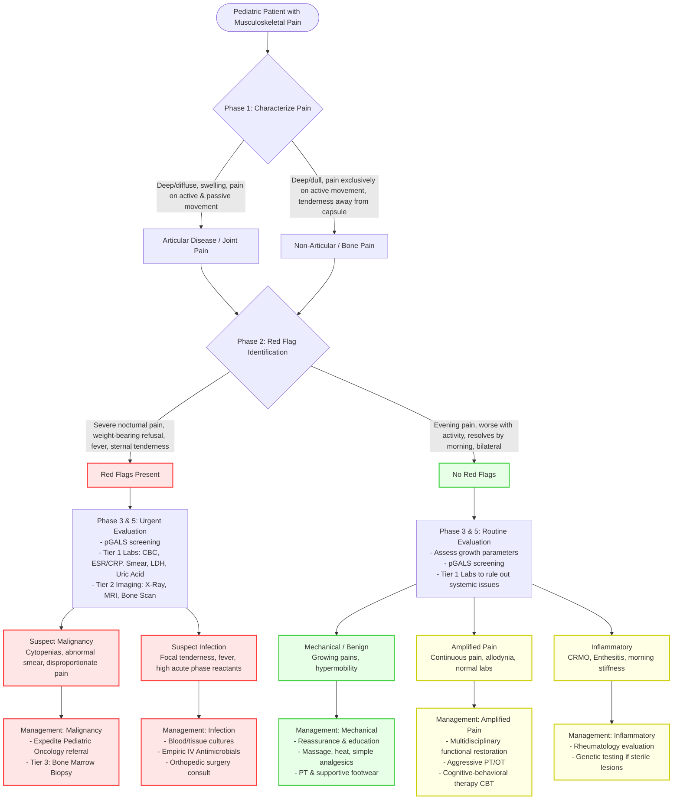

---
{"dg-publish":true,"uptext":"Back to Index (🦴 Rheumatology)","uplink":"/rheumatology/rheumatology/","permalink":"/rheumatology/approach-to-a-child-with-joint-pain/","dgPassFrontmatter":true}
---

## Algorithm

## Phase 1: Pain Characterization

### Differentiating Articular From Bone Pain

- Articular disease yields deep, diffuse pain during active and passive movements.
- Articular disease exhibits swelling, crepitation, instability.
- Bone pain described as deep, dull, or penetrating.
- Non-articular disease exhibits pain exclusively during active movement.
- Non-articular tenderness localizes distinctly away from joint capsule.

### Temporal Pattern And Chronology

- Acute pain lasts less than 2 weeks.
- Subacute pain lasts 2 to 6 weeks.
- Chronic pain lasts beyond 6 weeks.
- Morning stiffness exceeding 30 minutes strongly indicates inflammatory etiology.
- Pain worsened by activity suggests mechanical etiology.
- Evening pain after physical exertion suggests growing pains.
- Nighttime awakenings secondary to severe pain signal underlying malignancy.

## Phase 2: Red Flag Identification

### Malignancy Indicators

- Disproportionate bone pain relative to physical findings.
- Severe nocturnal pain causing sleep disruption.
- Sternal or diffuse bony tenderness.
- Short symptom duration less than 2 months.
- Discordant complete blood count parameters.
- Leukocytosis combined with thrombocytopenia raises severe malignancy suspicion.
- Normal inflammatory markers despite severe musculoskeletal pain.

### Infection Indicators

- Sudden onset severe pain with weight-bearing refusal indicates septic process or osteomyelitis.
- Localized exquisite bony tenderness associated with fever.

## Phase 3: Clinical Examination

### General Physical Assessment

- Assess growth parameters detecting linear growth failure.
- Palpate for generalized lymphadenopathy and hepatosplenomegaly suggesting neoplastic infiltration.
- Examine skin for vasculitic rashes, petechiae, or bruising.

### Musculoskeletal Screening

- Perform pediatric musculoskeletal screening (pGALS) evaluating gait, arms, legs, spine.
- Evaluate gait noting antalgic limp or refusal to bear weight.
- Palpate long bones systematically. Deep pain on palpation of long bones strongly suggests malignancy.
- Identify localized tenderness over entheses (tendon insertion sites) indicating enthesitis-related arthritis.

## Phase 4: Differential Diagnosis Categorization

### Table 1: Etiological Categories Of Pediatric Bone Pain

|Category|Specific Conditions|Clinical Clues|
|---|---|---|
|Neoplastic|Leukemia, neuroblastoma, osteosarcoma, Ewing sarcoma|Severe nocturnal pain, bone marrow infiltration pain, cytopenias, systemic symptoms.|
|Infectious|Osteomyelitis, diskitis, reactive post-infectious pain|Localized bone pain, focal tenderness, fever, elevated acute phase reactants.|
|Mechanical / Benign|Growing pains, hypermobility syndromes, stress fractures|Evening/night occurrence, normal physical exam, bilateral presentation, resolves by morning.|
|Amplified Pain|Complex regional pain syndrome, diffuse amplified pain syndrome|Continuous pain disproportionate to inciting event, allodynia, psychologic distress, normal labs.|
|Inflammatory|Chronic recurrent multifocal osteomyelitis (CRMO), enthesitis|Insidious onset, multiple sterile bony lesions, morning stiffness.|

### Table 2: Differentiating Growing Pains From Restless Legs Syndrome (RLS)

|Clinical Feature|Growing Pains|Restless Legs Syndrome|
|---|---|---|
|Nature of pain|Deep aching, cramping|Urge to move legs, unpleasant sensations|
|Timing|Late afternoon or evening|Worse later in day/night, occurs during rest|
|Relief mechanism|Massage, analgesics|Relief through movement|
|Laterality|Bilateral|Unilateral or bilateral|

## Phase 5: Stepwise Diagnostic Investigations

### Tier 1: Basic Laboratory Evaluation

- Complete blood count (CBC) essential detecting cytopenias highlighting malignancy.
- High erythrocyte sedimentation rate (ESR) with leukopenia and low-normal platelet count strongly suggests underlying leukemia.
- Erythrocyte sedimentation rate (ESR) and C-reactive protein (CRP) assess inflammatory burden.
- Peripheral blood smear mandatory excluding leukemic blasts.
- Serum chemistry including lactate dehydrogenase (LDH) and uric acid evaluates cell turnover in suspected malignancy.

### Tier 2: Imaging Modalities

- Plain radiographs detect fractures, osteomyelitis, bone tumors, structural dysplasias.
- Normal initial plain radiographs do not exclude early osteomyelitis or marrow-infiltrating malignancies.
- Magnetic resonance imaging (MRI) provides superior sensitivity detecting bone marrow edema, occult fractures, early osteomyelitis.
- MRI essential ruling out marrow-occupying malignancies when pain remains disproportionate.
- Radionuclide bone scans indicate early focus of infection showing increased uptake in affected bone parts.

### Tier 3: Advanced Diagnostics

- Bone marrow aspiration and biopsy required confirming diagnosis of leukemia or neuroblastoma.
- Genetic testing indicated for suspected autoinflammatory sterile bone lesions (e.g., CRMO).

## Phase 6: Algorithmic Management Principles

### Non-Inflammatory / Mechanical Pain

- Reassurance and education constitute primary management.
- Employ symptomatic relief utilizing massage, local heat, simple analgesics (acetaminophen, NSAIDs) for growing pains.
- Implement physical therapy, joint protection, supportive footwear for hypermobility-related pain.

### Amplified Pain Syndromes

- Implement multidisciplinary treatment targeting functional restoration and pain relief.
- Prescribe aggressive physical and occupational therapy.
- Utilize cognitive-behavioral therapy addressing coping skills and psychologic distress.
- Avoid escalating pharmacological interventions without functional rehabilitation.

### Malignant Or Infectious Pain

- Expedite referral to pediatric oncology upon identification of blasts, significant cytopenias, or marrow-occupying lesions on MRI.
- Initiate immediate empiric intravenous antimicrobial therapy for suspected osteomyelitis following appropriate blood and tissue cultures.
- Consult orthopedic surgery for suspected bone tumors or infections requiring surgical debridement or biopsy.