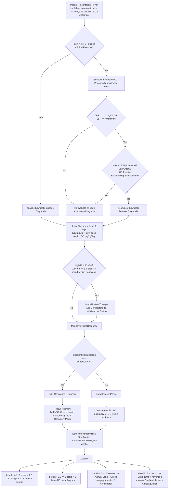

---
{"dg-publish":true,"uptext":"Back to Index (🦴 Rheumatology)","uplink":"/rheumatology/rheumatology/","permalink":"/rheumatology/kawasaki-disease/","dgPassFrontmatter":true}
---

## Introduction And Epidemiology

- Acute self-limited systemic vasculitis.
- Primarily affects infants and children under 5 years of age.
- Represents leading cause of acquired pediatric heart disease in developed nations.
- Carries 20-25% risk of coronary artery abnormalities if left untreated.
- Treatment with intravenous immunoglobulin reduces coronary risk to <5%.
- Demonstrates highest incidence in northeast Asian countries including Japan, South Korea, and Taiwan.
- Exhibits male predominance.

## Etiology And Pathogenesis

### Etiological Factors

- Exact pathogenesis remains completely unknown.
- Presumed infectious trigger in genetically susceptible hosts.
- Infrequent occurrence in infants <3 months implies protective maternal antibodies.
- Rare in adults implies prior exposure yielding immunity.
- Bacterial superantigen toxin theory proposed due to similarities with toxic shock syndrome.
- Demonstrates selective expansion of Vbeta2 and Vbeta8.1 T cells.

### Genetic Susceptibility

- Higher susceptibility documented in Asian and Pacific Islander descent.
- Concordance rate among identical twins approaches 13%.
- Linkage studies identify significant associations with polymorphisms in ITPKC, CASP3, BLK, and FCGR2A genes.
- Specific human leukocyte antigen region alleles influence disease risk.

### Vascular Pathology

- Panvasculitis predominantly affects medium-sized muscular arteries.
- Primarily targets coronary arteries, but may involve axillary, subclavian, and iliac arteries.
- Arteriopathy progresses through three distinct histological phases.
	- Phase 1 involves neutrophilic necrotizing arteritis occurring in first 2 weeks. Moves from endothelium through coronary wall. Yields saccular aneurysms.
	- Phase 2 involves subacute/chronic vasculitis lasting weeks to years. Driven by lymphocytes, plasma cells, and eosinophils. Yields fusiform aneurysms.
	- Phase 3 involves smooth muscle myofibroblast proliferation. Results in progressive luminal stenosis and occlusive thrombosis.

## Clinical Manifestations

### Disease Phases

- Acute febrile phase lasts 1-2 weeks. Characterized by unremitting fever and principal acute signs.
- Subacute phase lasts up to 3 weeks. Characterized by periungual desquamation, marked thrombocytosis, and highest risk of sudden death from aneurysms.
- Convalescent phase begins when clinical signs resolve. Continues until erythrocyte sedimentation rate normalizes at 6-8 weeks.

### Classic Diagnostic Criteria

- Diagnosis remains purely clinical. Lacks pathognomonic diagnostic test.
- Standard diagnosis requires fever lasting >= 5 days and 4 out of 5 principal clinical features.
- Experienced clinicians may establish diagnosis after 3 or 4 days of fever.

|Clinical Feature|Description|
|:--|:--|
|Ocular|Bilateral nonexudative bulbar conjunctival injection. Characteristically exhibits limbal sparing.|
|Mucocutaneous|Erythema of oral and pharyngeal mucosa. Strawberry tongue. Red, cracked, dry lips.|
|Extremity Changes|Acute phase shows erythema of palms/soles and indurative edema of hands/feet. Subacute phase shows periungual desquamation.|
|Polymorphous Rash|Maculopapular, urticarial, erythema multiforme-like, or scarlatiniform. Never bullous or vesicular.|
|Lymphadenopathy|Cervical lymphadenopathy. Usually unilateral. Measures >1.5 centimeters. Non-suppurative.|

### Non-Cardiac Manifestations

- Musculoskeletal: Arthritis or arthralgia involving small or large joints.
- Gastrointestinal: Unexplained vomiting, diarrhea, severe abdominal pain. Hydrops of gallbladder presents as upper abdominal mass. Mild hepatitis and transaminitis occur.
- Neurological: Extreme irritability prominent in infants. Aseptic meningitis yields cerebrospinal fluid pleocytosis. Transient sensorineural hearing loss. Rare facial nerve palsy.
- Renal/Genitourinary: Sterile pyuria, urethritis, meatitis. Acute renal failure represents rare complication.
- Dermatological: Perianal erythema and desquamation. Reactivation erythema and induration at bacillus Calmette-Guerin inoculation site.
## Algorithmic Approach

## Incomplete And Atypical Kawasaki Disease

- Manifests prolonged unexplained fever with fewer than 4 principal clinical features.
- Most common in infants <6 months of age.
- Carries highest risk for developing coronary artery abnormalities due to delayed diagnosis.
- Demands high index of suspicion and evaluation via specific laboratory and echocardiographic algorithms.

### Laboratory Criteria For Incomplete KD

- Considered when C-reactive protein >= 3.0 mg/dL or erythrocyte sedimentation rate >= 40 mm/hr.
- Requires >= 3 of the following 6 supplemental criteria:
    - Anemia for age.
    - Platelet count >= 450,000/mm3 after 7th day of fever.
    - Serum albumin <= 3.0 g/dL.
    - Elevated alanine aminotransferase.
    - White blood cell count >= 15,000/mm3.
    - Urine white blood cells >= 10/hpf.

### Echocardiographic Criteria For Incomplete KD

- Positive echocardiogram establishes diagnosis if ANY of 3 conditions met:
    - Z score of left anterior descending or right coronary artery >= 2.5.
    - Coronary artery aneurysm directly observed.
    - Presence of >= 3 suggestive features: decreased left ventricular function, mitral regurgitation, pericardial effusion, perivascular brightness, lack of vessel tapering, or Z scores in LAD/RCA between 2 and 2.5.

## Kawasaki Disease Shock Syndrome

- Constitutes rare, severe illness manifestation.
- Presents with vasodilatory cardiogenic shock, severe hypotension, and poor systemic perfusion.
- Characterized by markedly elevated C-reactive protein, severe hypoalbuminemia, and profound thrombocytopenia.
- Carries significantly increased risk for intravenous immunoglobulin resistance and giant coronary artery aneurysms.
- Demands immediate intensification of anti-inflammatory therapy and inotropic support.

## Investigations And Biomarkers

- Complete blood count reveals leukocytosis with neutrophilia and immature forms.
- Normocytic normochromic anemia frequently present.
- Thrombocytosis occurs typically in second week, occasionally exceeding 1,000,000/mm3.
- Acute phase reactants (erythrocyte sedimentation rate, C-reactive protein) universally elevated during acute phase.
- Elevated N-terminal pro-B-type natriuretic peptide (>500 pg/mL) assists in ambiguous diagnostic cases.
- Neck ultrasonography for lymphadenopathy classically reveals multiple enlarged nodes. Nodes are uniformly hypoechoic with absent necrosis and well-circumscribed margins (cluster of grapes appearance).

## Cardiovascular Imaging And Risk Stratification

- Echocardiography serves as primary, noninvasive imaging modality.
- Mandates highest-frequency transducer and accurate body surface area calculation.
- Requires baseline imaging at diagnosis, repeat at 1-2 weeks, and final acute assessment at 6-8 weeks.
- Quantitative Z scores (dimension adjusted for body surface area) of RCA or LAD dictate long-term management and risk.

|Z Score Classification|Definition And Morphology|Surveillance Protocol|
|:--|:--|:--|
|Level 1|Z score < 2. No involvement. Normal architecture.|Discharge from cardiology if normal at 12 months.|
|Level 2|2 <= Z score < 2.5. Dilation strictly resolving within 1 year.|Discharge from cardiology if normal at 12 months.|
|Level 3|2.5 <= Z score < 5. Persistent small aneurysm.|Annual echocardiogram. Consider stress imaging every 2 years.|
|Level 4|5 <= Z score < 10. Persistent medium aneurysm.|Annual echocardiogram and stress imaging.|
|Level 5|Z score >= 10 OR absolute >= 8 mm. Large or giant aneurysm.|Echocardiogram every 6 months. Annual stress imaging and advanced imaging (CT/MRI).|

## Acute Medical Management

### Standard Initial Therapy

- Goal involves rapid reduction of systemic inflammation to prevent coronary artery damage.
- Therapy mandates initiation within 10 days of fever onset, but indicated later if systemic inflammation persists.

| Medication                 | Dosage And Administration                                                                                                                                           | Clinical Considerations                                                                                                               |
| :------------------------- | :------------------------------------------------------------------------------------------------------------------------------------------------------------------ | :------------------------------------------------------------------------------------------------------------------------------------ |
| Intravenous Immunoglobulin | 2 g/kg infused as single continuous dose over 8-12 hours.                                                                                                           | Suppresses cytokine production and inhibits complement. Defers live virus vaccines (measles, varicella) for 11 months post-infusion.  |
| Aspirin (Acute Phase)      | Historically 30-50 mg/kg/day divided every 6 hours till the patient is afebrile for 6 hours. Recent 2024 AHA guidelines advocate low dose 3-5 mg/kg/day from onset. | Reduces risk of gastrointestinal bleeding and Reye syndrome with lower dose.                                                          |
| Aspirin (Convalescent)     | 3-5 mg/kg/day once daily.                                                                                                                                           | Maintained for minimum 6-8 weeks for antiplatelet activity in Level 1 and 2, or continued till Z Score normalizes in Level 3, 4 and 5 |

### Intensification Therapy For High-Risk Patients

- Strongly indicated for baseline RCA/LAD Z score >= 2.5, infants <6 months, or high Kobayashi risk score[^krs].
	- Corticosteroids: Intravenous methylprednisolone 2 mg/kg/day divided every 12 hours. Tapered slowly over 2-4 weeks.
	- Infliximab: Monoclonal tumor necrosis factor-alpha antibody. Dose updated to 10 mg/kg intravenously given over 2 hours.
	- Statins (Atorvastatin): Administered in older children to improve endothelial homeostasis and reduce oxidative stress.

### Management Of Intravenous Immunoglobulin Resistance

- Defined as persistent or recrudescent fever 36 hours post-initial IVIG completion.
- Occurs in 10-15% of patients. Carries profoundly increased risk for giant coronary aneurysms.
- Second IVIG Infusion: 2 g/kg administered intravenously.
- Corticosteroid Pulse: Intravenous methylprednisolone 30 mg/kg/day for 1-3 consecutive days.
- Biological Agents: Infliximab (10 mg/kg) or Anakinra (Interleukin-1 receptor antagonist).
- Refractory alternatives include Cyclosporine (inhibits calcineurin pathway), Cyclophosphamide, or Plasma Exchange.

## Antithrombotic And Anticoagulation Therapy

- Dual approach required for large aneurysms harboring severe risk of luminal thrombosis.
- Small/Medium Aneurysms (Z score < 10): Low-dose aspirin monotherapy. Consider adding Clopidogrel (1 mg/kg/day) for Z score 5-10.
- Giant Aneurysms (Z score >= 10): Mandates dual antiplatelet therapy plus systemic anticoagulation.
- Systemic anticoagulants include Warfarin (target INR 2-3), Low Molecular Weight Heparin, or Direct Oral Anticoagulants (Apixaban, Edoxaban).

## Complications And Long-Term Prognosis

### Acute Complications

- Macrophage Activation Syndrome: Potentially fatal complication secondary to cytokine storm. Features continuous fever, hepatosplenomegaly, hyperferritinemia (>684 ng/mL), hypofibrinogenemia. Treat with pulse methylprednisolone and Cyclosporine.
- Acute Myocardial Infarction: Risk peaks dramatically during first 2-3 months. Mandates immediate percutaneous coronary intervention or medical thrombolysis (tissue-type plasminogen activator).

### Long-Term Outcomes

- Complete regression to normal internal lumen diameter occurs in 50% of small to medium aneurysms over 1-2 years.
- Regressed aneurysms maintain myointimal thickening and abnormal vascular reactivity.
- Giant aneurysms rarely regress and carry indefinite lifetime risk of ischemia, stenosis, and thrombosis.
- Advanced surveillance utilizing Computed Tomography Angiography or Magnetic Resonance Angiography required annually for large/giant aneurysms.
- Surgical revascularization (coronary artery bypass grafting utilizing arterial grafts) indicated for severe reversible ischemia and complex stenosis.
- Structured health care transition to adult cardiology remains paramount for lifelong surveillance and cardiovascular risk factor management.

[^krs]:  Kobayashi risk score. High risk of IVIG resistance indicated by a total score of ≥ 4.
	<ul><li>Sodium ≤ 133 mmol/L (2 points).</li><li>Days of illness ≤ 4 at initial treatment (2 points).</li><li>Aspartate aminotransferase ≥ 100 IU/L (2 points).</li><li>Neutrophils ≥ 80% (2 points).</li><li>Platelet count ≤ 300,000/μL (1 point).</li><li>C-reactive protein ≥ 10 mg/dL (1 point).</li><li>Age ≤ 12 months (1 point).</li></ul>
	
