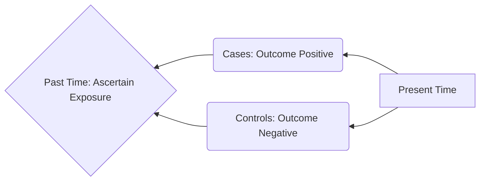

---
{"dg-publish":true,"uplink":"/statistics/statistics/","uptext":"Back to Index (🔢 Statistics)","dgPassFrontmatter":true,"permalink":"/statistics/case-control-study/"}
---

## Overview Of Case Control Studies

A case control study is an observational and non-experimental epidemiological study design. Researchers merely observe data without applying any active intervention.

- This design evaluates a possible association between a risk factor and a disease.
- The study begins by selecting a group of patients who already have the disease, termed as cases.
- These are compared to a group of individuals who are completely free of the disease, termed as controls.
- The researcher then works backward in time to assess past exposure to a suspected agent or factor.
- It is typically a retrospective study, but the methodology can also be applied to prospective studies.
- Crucially, this design cannot yield estimates of incidence or prevalence of the disease in the population.

### Schematic Flow Of A Case Control Study

_Note: The study proceeds backward from the present outcome to past exposure._

## Essential Design Considerations

Executing a case control study requires meticulous planning to minimize bias and ensure valid results.

### Formulation And Definition

- The researcher must start with a clearly defined hypothesis.
- Strict diagnostic criteria must be established to accurately define the cases.

### Selection Of Cases

- The source of cases must be representative of all cases of the disease within the target population.
- Researchers must decide whether to use incident cases or prevalent cases.
- Incident cases are newly diagnosed patients.
- Incident cases are generally preferred because they are expected to remember their past exposure status more accurately, thereby reducing recall bias.

### Selection Of Controls

- Controls must precisely meet all the diagnostic and demographic criteria applied to the cases, except they must not have the disease under investigation.
- Controls can be sourced from the general population.
- Hospital controls can be used. These are patients in the same hospital who are suffering from diseases unrelated to the exposure being studied.
- Special controls can also be utilized, which include friends, neighbors, peers, or family members of the cases.
- The ratio of controls to cases is an important statistical consideration.
- A ratio of 1:1 up to 4:1 is commonly used to increase the statistical power of the study as the sample size increases.
- Using a control-to-case ratio greater than 4:1 provides very little additional impact on statistical power.

### Ascertainment Of Exposure

- Measuring the past exposure status is highly prone to recall bias and observer bias.
- Exposure data can be ascertained using standardized questionnaires.
- Other methods include biological samples, patient interviews, or interviews with spouses and family members.
- Pre-existing documents like medical records or employment files can also be reviewed.

## Matching Cases And Controls

To eliminate the interference from confounding factors, the control group is matched with the case group. Confounding factors are variables related to both the exposure and the outcome, which could distort the true relationship if left unchecked.

- **Group Matching**: This is also known as frequency matching. It is performed on a group basis. The average value of potential risk factors for the entire group of cases is kept similar to the entire group of controls.
- **Pairwise Matching**: This is matching on an individual basis. Each case is matched individually to one or more controls possessing similar characteristics. These characteristics might include socioeconomic status, age, or environmental factors.

## Measures Of Association

The primary measure of association used in a case control study is the Odds Ratio (OR). Because the study does not capture the entire population at risk, it cannot calculate incidence rates or true relative risk.

### The 2x2 Contingency Table

Data from a case control study is arranged in a fourfold contingency table to facilitate the calculation of odds.

|Exposure Status|Disease Present (Cases)|Disease Absent (Controls)|
|:--|:--|:--|
|**Exposed (Yes)**|a|b|
|**Not Exposed (No)**|c|d|

### Calculating The Odds Ratio

- The Odds Ratio estimates the strength of the association between the exposure and the outcome.
- It is calculated by dividing the odds of having the disease among the exposed by the odds of having the disease among the non-exposed.
- The formula relies on cross-multiplication of the cells from the contingency table.

$$OR = \frac{Odds\ of\ disease\ among\ exposed}{Odds\ of\ disease\ among\ non-exposed} = \frac{a / b}{c / d} = \frac{a \times d}{b \times c}$$

### Interpreting The Odds Ratio

- The OR is a generally excellent approximation of the relative risk when the incidence rate of the disease is very low.
- **OR = 1.0**: Indicates no association between the exposure and the disease.
- **OR > 1.0**: Indicates that the exposure increases the odds of the outcome. The exposure is likely a risk factor.
- **OR < 1.0**: Indicates that the exposure decreases the odds of the outcome. The exposure is a potential protective factor.
- The 95% Confidence Interval (CI) of the OR must always be reported.
- If the 95% CI contains the value 1, the association is not considered statistically significant.

## Sample Size Estimation

Calculating the required sample size for an unmatched case control study involves a specific set of parameters.

- The researcher must define the desired statistical power.
- The desired ratio of controls to cases must be established in advance.
- The expected percentage of exposed individuals in the control group is required.
- The expected percentage of exposed individuals in the case group, or the expected Odds Ratio under the alternative hypothesis, must be estimated.

## Advantages And Disadvantages

| Advantages                                                                                | Disadvantages                                                                                   |
| :---------------------------------------------------------------------------------------- | :---------------------------------------------------------------------------------------------- |
| Highly useful for investigating **rare diseases**.                                        | Cannot provide true measures of disease incidence or prevalence.                                |
| Highly valuable for diseases with a very **long latent period.**                          | Causality is difficult to firmly establish because the sequence of events is hard to verify.    |
| Generally inexpensive and efficient to conduct.                                           | Highly susceptible to selection bias if appropriate controls are not chosen.                    |
| Less time-consuming than prospective cohort studies.                                      | Highly susceptible to recall bias because the study relies on retrospective reporting.          |
| Requires a much smaller sample size than cohort designs.                                  | Accuracy and validity of historical information cannot always be assured.                       |
| Extremely useful for generating new hypotheses.                                           | The results may be easily confounded by external factors.                                       |
| Multiple risk factors and exposures can be explored simultaneously within a single study. | It is difficult to obtain reliable information about an individual's exposure status over time. |