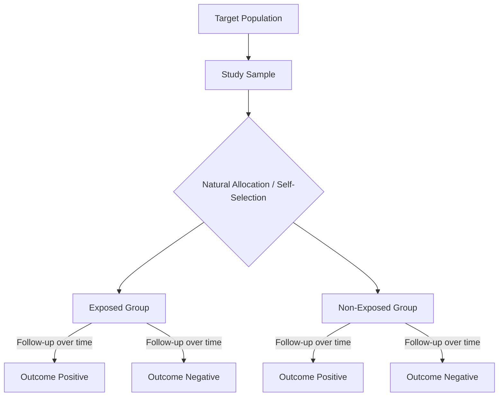

---
{"dg-publish":true,"uplink":"/statistics/statistics/","uptext":"Back to Index (🔢 Statistics)","dgPassFrontmatter":true,"permalink":"/statistics/cohort-study/"}
---

## Overview Of Cohort Studies

A cohort study is a type of observational and longitudinal study design commonly used in medical and epidemiological research. It evaluates a possible association between an exposure and an outcome by following groups of individuals over a period of time.

- The study groups consist of individuals who are exposed to a specific factor and those who are unexposed.
- Participants are followed to observe whether they develop the disease or outcome of interest.
- Crucially, the cohort is identified before the appearance of the disease under investigation.
- Subjects must be disease-free at entry and possess the potential to develop the outcome.
- A cohort study is defined based on the exposure status, never on the outcome status.

### Schematic Flow Of A Cohort Study

_Note: Allocation is natural, lacking the randomization seen in experimental trials._

## Types Of Cohort Studies

Cohort studies can be broadly classified based on the timing of data collection relative to the current time.

### Prospective Cohort Study

- Participants are identified in the present.
- They are followed up forward over time into the future.
- Observation continues until the outcome occurs or the study time limit is reached.
- This type reduces recall error and is considered to yield the most reliable results in observational epidemiology.

### Retrospective Cohort Study

- Both the exposure and the outcome have already occurred at the time the study begins.
- Researchers use pre-existing data, such as medical records or employee files, to assess past exposure.
- This design is less time-consuming and less expensive.
- It is more susceptible to bias, as information on exposure and confounding variables might be incomplete or inaccurate.

### Retrospective-Prospective Study

- This design combines both elements.
- The study begins with past data for baseline exposure and continues into the future for subsequent outcomes.

## Key Elements Of Conducting A Cohort Study

The execution of a cohort study requires meticulous planning and adherence to a sequence of steps.

- Selection of a representative sample from the population or a self-allocated group.
- Precise measurement of the exposure variable within the sample.
- Verification that the outcome variable is absolutely absent at the time of entry.
- Systematic follow-up of the different exposure groups for a predetermined period.
- Measurement of the occurrence of the outcome variable during the study period.

## Measures Of Association And Statistical Analysis

The primary analytical objective in a cohort study is to determine the rates of disease incidence among the exposed and unexposed groups and compare them.

### Incidence Rate And Person-Years

- Cohort studies measure the true incidence of a disease.
- Incidence proportion calculates the percentage of a population developing the disease.
- Incidence rate utilizes the person-years of observation to account for different follow-up times for each individual.
- Incidence rate is calculated by dividing the number of new cases by the total follow-up time for all persons.

### The 2x2 Contingency Table

Data from a cohort study is typically arranged in a two-way table to facilitate the calculation of risks.

|Exposure Status|Disease Present|Disease Absent|Total|
|:--|:--|:--|:--|
|**Exposed**|a|b|a + b|
|**Non-Exposed**|c|d|c + d|
|**Total**|a + c|b + d|a + b + c + d|

### Relative Risk (Risk Ratio)

- The Relative Risk (RR) estimates the strength of the association between the exposure and the outcome.
- It is the incidence of the disease among the exposed divided by the incidence among the non-exposed.

$$RR = \frac{\text{Incidence among exposed}}{\text{Incidence among non-exposed}} = \frac{a / (a + b)}{c / (c + d)}$$

#### Interpretation Of Relative Risk

- **RR = 1.0**: The risk is identical in both groups. Indicates a lack of association.
- **RR > 1.0**: The risk is higher in the exposed group. The exposure is a potential risk factor.
- **RR < 1.0**: The risk is lower in the exposed group. Suggests a protective effect of the exposure.
- The confidence interval (CI) must be reported. If the 95% CI does not contain 1, the association is considered statistically significant.

### Attributable Risk

- Attributable risk calculates the absolute difference in incidence rates between the exposed and non-exposed groups.
- It refers to the absolute increase in risk that can be directly attributed to the risk factor.
- If the confidence interval for attributable risk includes zero, there is no significant association.

### Time-To-Event Analysis

- When exact survival times or times to the outcome event are known, survival analysis techniques are applied.
- The Kaplan-Meier method estimates the cumulative probability of remaining free of the event.
- The Log-rank test can be used to compare the survival curves of the exposed versus non-exposed groups.
- Cox proportional hazards regression evaluates the effect of multiple risk factors on survival and provides a Hazard Ratio.

## Advantages And Disadvantages

|Advantages|Disadvantages|
|:--|:--|
|Establishes a clear temporal sequence. Proves exposure occurred before the outcome, providing evidence for causality.|Expensive and time-consuming.|
|Highly valuable for investigating rare exposures.|Inefficient for studying rare outcomes or diseases.|
|Directly measures the incidence of a disease.|Requires a large number of subjects.|
|Can study multiple outcomes arising from a single exposure.|Often necessitates a long follow-up period.|
|Relative Risk is a straightforward measure of association.|Loss to follow-up (attrition) severely affects the validity of results.|

## Distinguishing Cohort Studies From Other Designs

### Cohort Study Vs. Randomized Controlled Trial (RCT)

- In a cohort study, no active intervention or treatment is administered by the researcher.
- Researchers merely observe pre-existing exposures or natural self-selection.
- In contrast, an RCT involves random allocation of an intervention or placebo to the participants.

### Cohort Study Vs. Case-Control Study

- A cohort study proceeds forward from exposure to the disease outcome.
- A case-control study works backward. It starts with patients who already have the disease (cases) and compares them to healthy individuals (controls) to identify past exposures.
- Cohort studies provide measures of true incidence and relative risk.
- Case-control studies cannot yield incidence rates and must rely on the Odds Ratio (OR) as an approximation of relative risk.