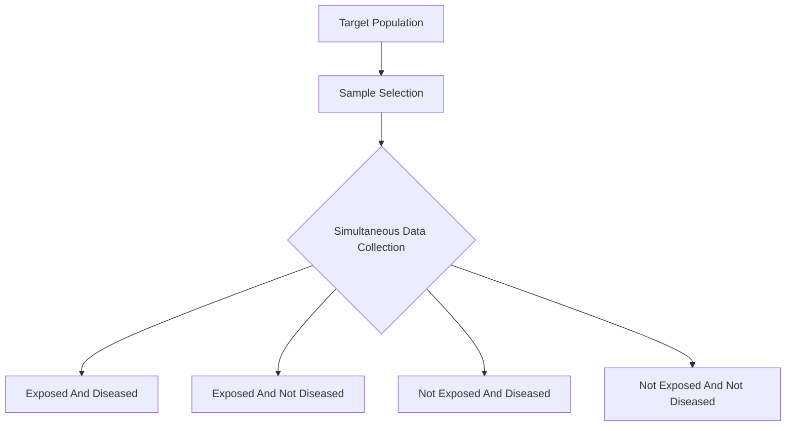

---
{"dg-publish":true,"uplink":"/statistics/statistics/","uptext":"Back to Index (🔢 Statistics)","dgPassFrontmatter":true,"permalink":"/statistics/cross-sectional-studies/"}
---

## Overview And Definition

A cross-sectional study is a fundamental type of observational and non-experimental research design. Researchers merely observe and collect data without applying any active intervention.

- This design evaluates the characteristics of a population at a single, defined point in time.
- It is frequently described as providing a "snapshot" of the target population.
- The entire process of data collection may span several weeks or months.
- However, data from each individual participant is recorded only once during that period.
- It assesses the current status of both the exposure variables and the outcome variables simultaneously.
- Due to this simultaneous measurement, the temporal sequence between exposure and disease cannot be established.
- A causal link between an exposure and an outcome cannot be firmly concluded.

### Structural Flow Of A Cross-Sectional Study

## Primary Objectives

Cross-sectional studies are highly versatile and serve multiple functions within medical and epidemiological research.

### Descriptive Objectives

- To determine the prevalence of a specific disease within a population.
- To find out how widely a disease prevails across different geographical areas.
- To map the distribution of a disease among different demographic populations and times.
- To identify which specific subgroups are at the highest risk of contracting the disease.
- To outline the age and sex distributions of individuals suffering from a specific condition.

### Analytical Objectives

- To explore potential associations between various exposure factors and outcome variables.
- To conduct bivariate analysis to study the simple relationship between two variables.
- To conduct multivariable analysis to study associations while statistically controlling for confounding variables.
- To generate new clinical hypotheses that can be tested later with prospective cohort studies or clinical trials.

### Public Health Objectives

- To evaluate the results or impact of a medical intervention at a population level.
- To actively detect previously undiagnosed patients to provide them with early treatment.
- To prevent the ongoing progression of a disease by identifying it early in the community.

## Data Organization And Statistical Analysis

Data gathered during a cross-sectional study is typically organized into a matrix to facilitate statistical analysis and probability calculations.

### The Contingency Table

When dealing with categorical data, researchers arrange the subjects into four possible groups using a two-way contingency table.

|Exposure Status|Disease Present|Disease Absent|Total|
|:--|:--|:--|:--|
|**Exposed**|a|b|a + b|
|**Not Exposed**|c|d|c + d|
|**Total**|a + c|b + d|a + b + c + d|

### Prevalence Calculations

Unlike cohort studies, cross-sectional studies cannot measure true disease incidence. They are utilized strictly to calculate prevalence.

- **Overall Disease Prevalence**: The proportion of the total sample that currently has the disease. $$Prevalence = \frac{a + c}{a + b + c + d}$$
- **Prevalence Among Exposed**: The proportion of exposed individuals who have the disease. $$Prevalence\ (Exposed) = \frac{a}{a + b}$$
- **Prevalence Among Non-Exposed**: The proportion of unexposed individuals who have the disease. $$Prevalence\ (Non-Exposed) = \frac{c}{c + d}$$
- Researchers compare the prevalence of the disease in exposed persons directly to the prevalence in non-exposed persons to assess association.

## Population Sampling Techniques

To ensure the snapshot accurately reflects the larger population, researchers must draw a representative sample. Various probability sampling methods are utilized.

### Simple Random Sampling

- Every individual within the target population has the exact same probability of being sampled.
- This is the most intuitive form of sampling.
- It requires a complete and exhaustive sampling frame of the population.
- It is most suitable for relatively small or well-documented populations.

### Stratified Sampling

- The target population is subdivided into homogeneous groups called strata.
- Strata are often based on key characteristics like geography, age, or socioeconomic status.
- A probability sample is then randomly selected from within each individual stratum.
- This method effectively controls for confounding factors that may influence study results.
- It yields the smallest sampling error among the standard methods.

### Cluster Sampling

- The population is divided into natural, pre-existing clusters, such as neighborhoods or schools.
- A random sample of these entire clusters is selected for the study.
- Every individual within the chosen clusters is subsequently measured or surveyed.
- This method yields the largest sampling error among the standard methods.

## Methodological Limitations And Biases

The validity of a cross-sectional study can be severely compromised by specific forms of systemic error or bias.

- **Non-Response Bias**: A high rate of refusal to participate can skew the data. The participating sample may systematically differ from those who refused.
- **Recall Bias**: Participants are required to remember and report past behaviors, exposures, or symptoms. Human memory is fallible, leading to inaccurate exposure ascertainment.
- **Reporting Bias**: Participants may intentionally underreport socially undesirable behaviors or overreport desirable ones.
- **Measuring Bias**: Inconsistencies or errors may occur during the physical measurement of variables or the administration of surveys.

## Advantages And Disadvantages

|Advantages|Disadvantages|
|:--|:--|
|Quick and relatively inexpensive to conduct.|Cannot establish causality due to the lack of temporal sequencing.|
|Easy and feasible to organize for small research teams.|Highly ineffective for studying rare outcomes or diseases.|
|Avoids the problem of loss to follow-up (attrition bias) completely.|High susceptibility to non-response and recall biases.|
|Highly effective for determining the point prevalence of a disease.|Cannot provide estimates of disease incidence rates.|
|Can assess multiple exposures and multiple outcomes simultaneously.|Cannot provide true estimates of relative risk.|
|Useful for generating new hypotheses for future analytical studies.|Confounds ongoing disease duration with true disease etiology.|
|Can be repeated over time to evaluate trends in population health.||