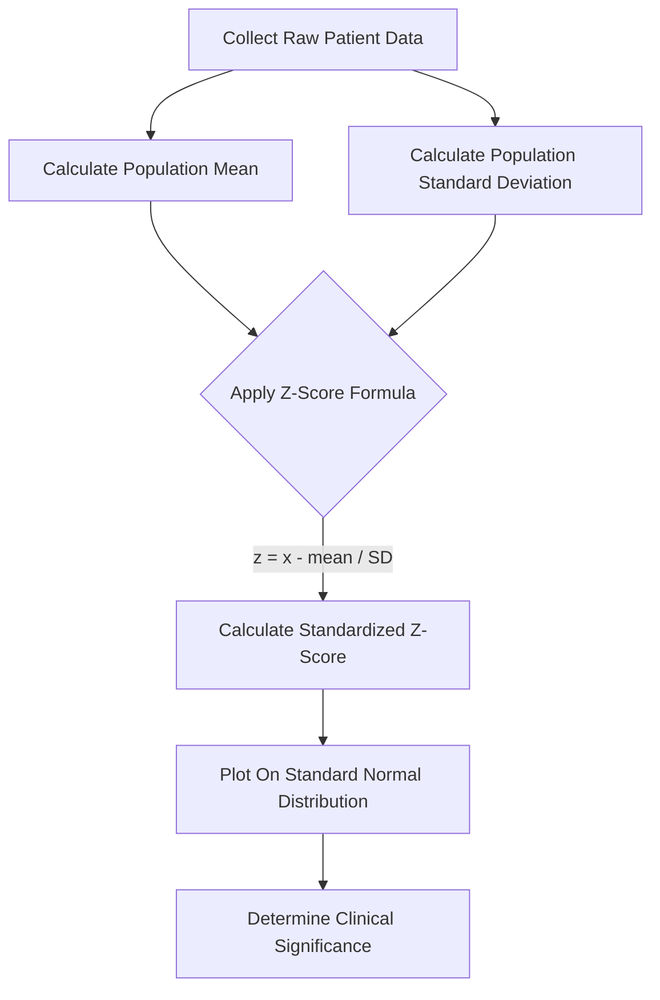

---
{"dg-publish":true,"uplink":"/statistics/statistics/","uptext":"Back to Index (🔢 Statistics)","permalink":"/statistics/percentiles-and-z-scores/","dgPassFrontmatter":true}
---

## Overview Of Positional Measures

- Positional measures describe the relative standing of a specific data point within a dataset.
- They are essential in medical statistics for establishing normal physiological ranges.
- They allow clinicians to compare individual patient data to a larger reference population.
- The two most critical positional measures are percentiles and z-scores.

## Percentiles

### Definition And Concept

- A percentile indicates the specific value below which a certain percentage of observations fall.
- It evaluates the relative standing of a measurement within a dataset.
- To calculate percentiles, all raw data must first be arranged sequentially from the smallest to the largest value.
- The ordered dataset is then divided into 100 equal parts to identify the specific percentile ranks.

### Key Percentiles And Quartiles

- Specific percentiles directly correspond to the five-number summary and data quartiles.
- **25th Percentile**: This value is identical to the first quartile (Q1). It represents the numerical value below which 25% of the data fall.
- **50th Percentile**: This represents the median of the dataset. It accurately marks the center point of the ordered data.
- **75th Percentile**: This value is identical to the third quartile (Q3). It represents the value below which 75% of the observations lie.
- The distance between the 25th percentile and the 75th percentile is the Interquartile Range (IQR).
- The IQR contains the middle 50% of the recorded data.

### Clinical And Statistical Applications

- Percentiles are frequently used for reporting individual scores in international exams or tests.
- Scoring at the 85th percentile means a candidate scored better than 85% of those who took the test.
- In medicine, percentiles are utilized to identify the precise limits of a normal range.
- A very common clinical example is the use of pediatric growth charts.
- A normal physiological range might be defined as values falling between the 5th and 95th percentiles.
- Patient scores outside this interval belong to the lowest or highest 5% of the population and are therefore considered abnormal.

## Z-Scores (Standard Scores)

### Definition And Concept

- The z-score standardizes the relative position of a raw score above or below the mean value.
- It is also commonly referred to in literature as the standard score.
- The z-score specifies the exact number of standard deviations by which a patient's result differs from the population mean.
- It allows researchers to evaluate and standardize values originating from any normal distribution.

### The Standard Normal Distribution

- Any normally distributed value can be transferred to a standardized z-value.
- This statistical process converts a standard normal distribution curve into a standard normal one.
- The standard normal distribution is strictly defined by a mean ($\mu$) of 0 and a standard deviation ($\sigma$) of 1.
- Standardizing scores allows for the direct comparison of relative positions across entirely different samples.
- Once a score is standardized, researchers can use a z-table to determine exact probabilities.
- For instance, a z-score of 2 indicates that 97.44% of scores fall below this specific value.

### Mathematical Calculation

- The calculation of a z-score requires the individual raw value, the population mean, and the population standard deviation.

$$z = \frac{x - \mu}{\sigma}$$

- Where $z$ represents the standardized score.
- $x$ represents the original raw measurement.
- $\mu$ represents the population mean.
- $\sigma$ represents the population standard deviation.

### Clinical And Statistical Applications

- Z-scores are highly useful to put population measurements like height, body mass index, and weight into context.
- They are utilized to compare an individual patient's data directly to age-matched reference groups.
- For example, bone mineral density (BMD) in wrist fracture patients is routinely evaluated using z-scores.
- A z-score of -2 indicates that the patient's BMD is exactly 2 standard deviations below the mean of an age-matched and sex-matched population.

## Comparison Between Percentiles And Z-Scores

|Feature|Percentile|Z-Score (Standard Score)|
|:--|:--|:--|
|**Primary Function**|Indicates the percentage of data falling below a specific value.|Measures the number of standard deviations a value is from the mean.|
|**Data Prerequisite**|Data must be ordered from smallest to largest.|Requires knowledge of the population mean and standard deviation.|
|**Distribution Type**|Applicable to any data distribution, including highly skewed data.|Relies heavily on the underlying assumption of a normal distribution.|
|**Measurement Unit**|Expressed as a percentage or rank (e.g., 85th percentile).|Expressed purely in standard deviation units.|
|**Standard Example**|Pediatric growth charts.|Bone mineral density (BMD) reference scoring.|

## Schematic Flowchart Of Standardizing Data

