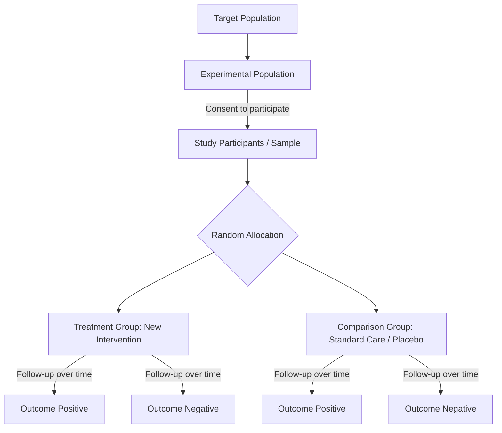

---
{"dg-publish":true,"uplink":"/statistics/statistics/","uptext":"Back to Index (🔢 Statistics)","permalink":"/statistics/randomized-controlled-trials-rct/","dgPassFrontmatter":true}
---

## Overview Of Randomised Controlled Trials

A randomised controlled trial (RCT) is an interventional study design in which subjects are randomly allocated to different treatment options.

- The RCT is widely considered the gold standard of individual medical research studies.
- It generates reliable safety and efficacy data for health interventions such as drugs, diagnostic devices, and therapy protocols.
- The primary goal is to assess the effect of an intervention against an active agent, an inert substance (placebo), or standard care.
- RCTs limit the potential for bias by randomly assigning patient pools to different groups.
- Random allocation ensures that the incidence of both known and unknown confounding factors is distributed equally between the groups.

## Core Methodological Principles

### Randomization

- Randomization refers to the random assignment of patients to the different treatments considered in the study.
- It removes selection bias and produces balanced study groups.
- **Simple randomization**: Each patient has a defined probability, usually 50/50, of receiving the new drug or the placebo.
- **Block randomization**: Divides patients into blocks to ensure treatment and covariate balance during the recruitment phase.
- **Stratified randomization**: Groups patients according to pre-specified covariate values (like gender or age) to form strata before randomizing, which reduces imbalance due to prognostic characteristics.

### Allocation Concealment And Blinding

- **Allocation concealment**: Prevents caregivers from knowing the group assignment prior to definitively allocating patients. It prevents preferential recruitment of unhealthier participants to a specific arm.
- **Blinding (Masking)**: Withholds information about treatment allocation from patients, treating physicians, or statisticians. It eliminates bias due to subjectivity in reporting or evaluating data.

|Blinding Type|Description|
|:--|:--|
|**Open label**|No blinding is used. Both the patient and physicians know the treatment allocations.|
|**Single blinded**|The patient does not know what drug they are taking.|
|**Double blinded**|Both the patient and the investigator do not know which patient is receiving which treatment.|
|**Triple blinded**|The patient, investigator, and the biostatistician analyzing the data are kept unaware of the allocations.|

## Types Of RCTs Based On Structural Design

RCTs can utilize different structural designs based on the nature of the intervention and disease.

### Parallel Design

- Patients are randomized to one of the treatment groups.
- Each patient receives only one type of treatment.
- It is the most common structural design for clinical trials.

### Cross-Over Design

- Each participant is exposed to both the control and the intervention in a sequence.
- Each individual serves as his or her own control.
- It requires a washout period to eliminate carry-over effects from the first treatment.
- The analysis is complex, but it allows for a smaller sample size.

### Factorial Design

- Tests the effect of more than one treatment simultaneously.
- A 2x2 factorial design involves four groups (e.g., A only, B only, A + B, neither).
- It allows the assessment of potential interactions among the treatments.

### Cluster Randomized Trials

- Groups or clusters of individuals are randomly allocated rather than individual subjects.
- The unit of randomization can be families, schools, or geographical areas.
- It is used to avoid treatment contamination among participants.
- The statistical analysis is more complex as it must account for the clustering effect.

### N-Of-1 Trials

- Trials in which a single patient is treated with two or more treatments on multiple occasions.
- The objective is to use these repeated episodes to draw controlled inferences about the effect of the treatment on that individual.
- It can be viewed as a special case of the crossover design.

## Types Of RCTs Based On Hypothesis Objectives

Trials are also classified based on what the researchers are aiming to prove regarding the new intervention.

### Superiority Trials

- The aim is to prove that the new drug is better (more efficacious) than a placebo or current treatment.
- It must have adequate statistical power to detect a clinically meaningful difference between the two treatments.

### Non-Inferiority Trials

- The aim is to prove that the new drug is no worse than the current standard treatment.
- The treatment must not be worse than the control by a pre-specified amount referred to as the non-inferiority margin.
- Often used when a new drug might offer secondary benefits like lesser toxicity, cheaper cost, or easier administration.

### Equivalence Trials

- The aim is to determine whether one intervention is therapeutically similar to another.
- The hypothesis tests whether the treatment effect lies within a pre-defined equivalence margin.

## Types Of RCTs Based On Pragmatism

### Explanatory Trials

- Designed strictly to explain how a treatment works.
- Investigators set strict inclusion criteria to produce highly homogeneous study groups.
- The aim is to acquire information on the true effect of treatment under ideal conditions.

### Pragmatic Trials

- Designed to determine whether a treatment works and to describe all consequences of its use under circumstances close to real clinical practice.
- They use more lax inclusion criteria and tend to use active controls rather than placebo controls.
- The aim is to make a practical decision about the therapeutic strategy.

## Phases Of Clinical Trials

Clinical trials evaluating new pharmaceutical interventions progress through four sequential phases.

- **Phase I**: Initial clinical trial on a new compound, usually conducted among healthy volunteers to assess safety and determine the maximum tolerated dose.
- **Phase II**: Conducted in patients to determine the optimum dose and to assess the short-term efficacy of the compound.
- **Phase III**: Large multicenter comparative clinical trials. Designed to demonstrate the safety and efficacy of the new treatment with respect to standard treatments to support product license applications.
- **Phase IV**: Post-marketing studies conducted after a drug is marketed to provide additional details about long-term safety, efficacy, and usage profiles.

## Statistical Analysis Methods In RCTs

Handling patient attrition and protocol non-compliance is critical in RCT analysis.

|Analysis Method|Description|Characteristics|
|:--|:--|:--|
|**Intention-To-Treat (ITT)**|Analyzes all patients based on their original allocated group regardless of the actual treatment received or dropouts.|Preserves the benefits of randomization. Provides a pragmatic estimate of the population-level effect.|
|**Per-Protocol Analysis**|Analyzes only the patients who strictly complied with the trial protocol and the allocated intervention.|Evaluates the effect of adherence to treatment assignment. Highly susceptible to confounding bias.|
|**As-Treated Analysis**|Patients are analyzed according to the actual treatment they received, ignoring original allocation.|Gives the maximum estimate of treatment effects but is extremely vulnerable to selection bias.|

## Advantages And Disadvantages Of RCTs

### Advantages

- Provides stronger evidence compared to observational studies.
- Demonstrates causality effectively.
- Randomization controls for both measured and unmeasured confounding variables.
- Serves as the gold standard for generating scientific evidence for new interventions.

### Disadvantages

- Trials can be very costly and require extensive resources.
- Long follow-up periods might be needed for certain clinical outcomes.
- Non-compliance, treatment cross-over, or loss to follow-up (attrition) severely affects validity.
- Ethical and practical considerations sometimes make RCTs impossible to conduct.
- Concerns exist regarding external validity (generalizability) because highly selected trial participants may not fully represent the general population.