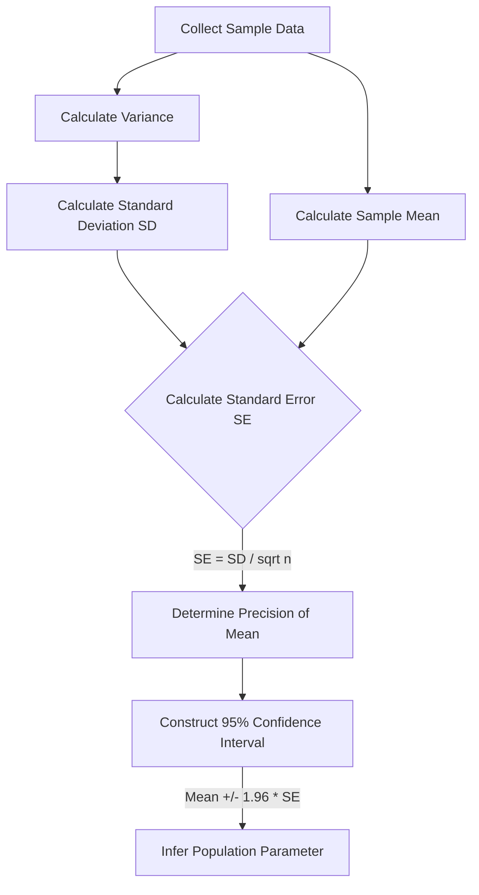

---
{"dg-publish":true,"uplink":"/statistics/statistics/","uptext":"Back to Index (🔢 Statistics)","permalink":"/statistics/standard-deviation-and-standard-error/","dgPassFrontmatter":true}
---

## Overview Of Variation Measures

Variation measures describe the spread or dispersion of data within a distribution. Medical statistics relies heavily on understanding this variability to draw accurate inferences from sample data to the larger population. Two of the most critical measures used to quantify variability are the standard deviation and the standard error.

## Standard Deviation (SD)

### Definition And Concepts

- The standard deviation is a descriptive measure of spread.
- It represents the average distance of the individual data values from their overall mean.
- It quantifies the variation that exists within one single sample.
- Standard deviation is expressed in the same units of measurement as the original data and the mean.
- The population standard deviation is represented by the Greek letter $\sigma$ (sigma).
- The sample standard deviation is represented by the Latin letter $s$ or $S$.
- When the sample size is greater than or equal to 60, the sample standard deviation ($S$) is generally considered a reliable estimate of the population standard deviation ($\sigma$).

### Calculation And Formulas

- The calculation of standard deviation relies on the variance.
- Variance is the mean of the squared differences between individual observations and the overall mean.
- Standard deviation is calculated as the positive square root of the variance.

#### Mathematical Formulas

- **Sample Variance ($s^2$)**: $$s^2 = \frac{\sum (x_i - \bar{x})^2}{n-1}$$
- **Sample Standard Deviation ($s$)**: $$s = \sqrt{s^2}$$
- The denominator uses $n-1$ (where $n$ is the sample size) instead of $n$.
- This subtraction is known as **Bessel's correction.**
- Because a sample is only a fraction of the actual population, any calculation from the sample tends to underestimate the true population parameter.
- Dividing by $n-1$ adjusts for this underestimation and provides a better, unbiased estimate of the population variance.

### Characteristics And Interpretation

- A small standard deviation indicates that data points are clustered closely around the mean.
- A large standard deviation indicates that the data points are widely spread out from the mean.
- Standard deviation is highly affected by the presence of extreme values or outliers.
- It is most appropriate for describing continuous variables that are normally distributed.
- Mean and standard deviation are complementary. They are required together to report descriptive statistics for symmetrical data.

## Standard Error (SE)

### Definition And Concepts

- The standard error (also known as standard error of the mean or SEM) is a measure of precision.
- It represents the **standard deviation of the sampling distribution** of a given statistic.
- It quantifies the variation in the means calculated from multiple random samples drawn from the same population.
- It tells us how accurate the mean of any given sample is likely to be compared to the true, unknown population mean.
- Mean and standard error are required together for reporting inferential statistics.

### Calculation And Formulas

- In practical applications, researchers do not take multiple samples.
- The standard error can be calculated directly from a single sample using the sample's standard deviation and the sample size.

#### Mathematical Formula

- **Standard Error ($SE$)**: $$SE = \frac{s}{\sqrt{n}}$$
- Where $s$ is the standard deviation and $n$ is the number of subjects in the sample.

### Characteristics And Interpretation

- The standard error is a measure of data precision, whereas standard deviation is a measure of data variability.
- A smaller standard error indicates that the calculated sample mean is likely closer to the true population mean.
- An increase in the standard deviation of the population increases the standard error.
- An increase in the sample size ($n$) decreases the standard error.
- As the sample size gets closer to the true size of the population, the sample means cluster more tightly around the true population mean.

## Key Differences Between SD And SE

### Conceptual Comparison

- **Nature**: Standard deviation describes the dispersion of individual data points. Standard error describes the dispersion of sample means.
- **Magnitude**: The standard error will always be smaller than the standard deviation of the same dataset.
- This occurs because sample means are always less spread out than the original individual data points. The mathematical formula ($SE = SD / \sqrt{n}$) guarantees this relationship.

### Tabular Comparison

|Feature|Standard Deviation (SD)|Standard Error (SE)|
|:--|:--|:--|
|**Purpose**|Measures data variability and spread.|Measures data precision and accuracy of the mean estimate.|
|**Quantifies**|Variation within a single sample.|Variation in the means from multiple samples.|
|**Calculation**|$\sqrt{\text{Variance}}$.|$SD / \sqrt{n}$.|
|**Statistical Role**|Used in Descriptive Statistics.|Used in Inferential Statistics.|
|**Relation to Sample Size**|Relatively stable as sample size changes.|Decreases as sample size increases.|

## Application In Normal Distribution

### The Empirical Rule (68-95-99.7)

- Many naturally occurring continuous variables exhibit a normal distribution (a symmetric, bell-shaped curve).
- The normal distribution is completely defined by two parameters: the mean ($\mu$) and the standard deviation ($\sigma$).
- Data distribution follows a strict empirical rule based on standard deviations:
    - **68%** of the observations lie within one standard deviation of the mean ($\mu \pm 1 SD$).
    - **95%** of the observations lie within two standard deviations of the mean ($\mu \pm 1.96 SD$).
    - **99.7%** of the observations lie within three standard deviations of the mean ($\mu \pm 3 SD$).

## Application In Inferential Statistics

### Confidence Intervals

- The standard error is essential for constructing confidence intervals.
- A confidence interval (CI) is an estimated range of values which has a certain probability of including the unknown population parameter.
- The Central Limit Theorem states that for large sample sizes, the sampling distribution of the mean is approximately normal.
- Utilizing this normal distribution, the 95% Confidence Interval for the mean is calculated using the standard error.
- **Formula for 95% CI**: $$95\% CI = \text{Sample Mean} \pm (1.96 \times SE)$$
- A wider standard error will result in a wider confidence interval.
- A wider interval indicates that the estimate of the population mean is less precise.
- A smaller sample size yields a larger standard error, thereby widening the confidence interval.

### Flowchart: From Data Collection To Confidence Interval

