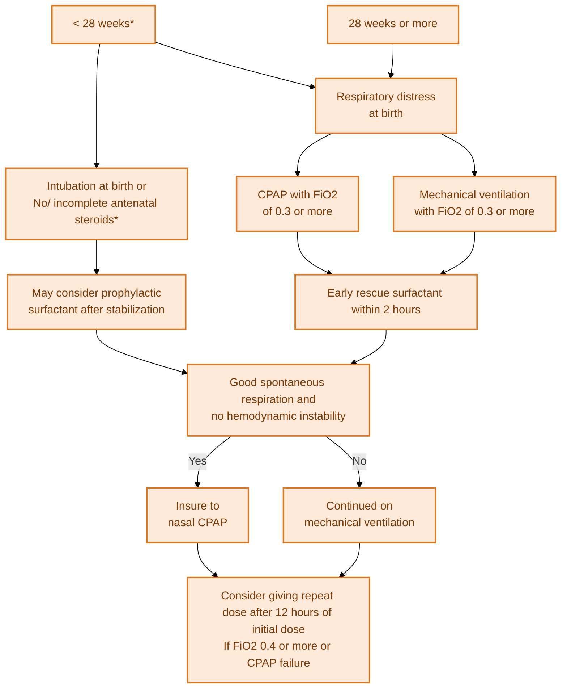

---
{"dg-publish":true,"uptext":"Back to Index (Neonatology)","uplink":"/neonatology/","permalink":"/neonatalogy/surfactant-therapy/","dgPassFrontmatter":true}
---

## Physiology And Rationale

- Term infants typically possess a robust surfactant storage pool of approximately 100 mg/kg.
- Preterm infants have a severely limited estimated pool of only 4 to 5 mg/kg at birth.
- Exogenous surfactant therapy acutely supplements these insufficient endogenous stores.
- It rapidly increases the pool size and improves pulmonary gas exchange.
- The therapy supports lung function until endogenous surfactant is adequately synthesized and released.

## Types Of Surfactant Preparations

- Natural surfactants are clinically superior to synthetic variants.
- Animal-derived products contain surfactant proteins B and C which are essential for function.
- First-generation protein-free synthetic surfactants are obsolete and no longer used.

|Surfactant Category|Sub-type|Examples|
|---|---|---|
|Natural (Animal-Derived)|Minced Lung Extract|Beractant (Survanta), Poractant alfa (Curosurf), Surfactant TA|
|Natural (Animal-Derived)|Lung Lavage Extract|Bovine Lipid Extract Surfactant (BLES), Calfactant (Infasurf)|
|Synthetic (Second Gen)|Protein Analogues|Lucinactant (Surfaxin), rSP-C surfactant (Venticute)|
|Synthetic (Third Gen)|SP-B and SP-C Enriched|CHF 5633|

### Comparison Of Common Natural Surfactants

|Preparation|Source|Dose Volume|Phospholipid Dose|
|---|---|---|---|
|Beractant (Survanta)|Bovine|4 ml/kg|100 mg/kg|
|Poractant alfa (Curosurf)|Porcine|2.5 ml/kg|200 mg/kg|
|Neosurf|Bovine|5 ml/kg|135 mg/kg|

## Indications For Therapy

### Primary Indication

- Respiratory distress syndrome (RDS) is the primary indication.
- It is indicated in neonates with increasing oxygen requirements (FiO2 >0.30) on optimal continuous positive airway pressure (CPAP).

### Secondary Surfactant Inactivation

- Surfactant is frequently inactivated by blood, meconium, or inflammatory exudates.
- It is utilized as an adjunct therapy in meconium aspiration syndrome (MAS).
- Other indications include severe congenital pneumonia, pulmonary hemorrhage, and acute respiratory distress syndrome (ARDS).
- It is useful in persistent pulmonary hypertension of the newborn (PPHN) associated with underlying atelectasis.

## Strategies Of Administration

### Prophylactic Surfactant

- Administered within 15 to 30 minutes of birth regardless of RDS signs.
- Recent evidence shows an increased risk of bronchopulmonary dysplasia (BPD) and mortality compared to selective administration.
- It is restricted to extreme preterm neonates (<28 weeks) who received no or incomplete antenatal steroids.
- It is also indicated if the neonate requires immediate intubation and mechanical ventilation for stabilization.

### Early Rescue Surfactant

- Administered within 2 hours of life in an infant exhibiting features of RDS.
- Retained lung fluid in the early hours assists in the homogenous distribution of the surfactant.
- It prevents widespread atelectasis from becoming established.
- It reduces the risk of neonatal mortality, BPD, and air leak syndromes.

### Late Rescue Surfactant

- Administered after 2 hours of life in neonates showing established RDS features.
- Frequently utilized in outborn neonates who face delayed transport to referral centers.

## Methods Of Delivery

### Conventional Endotracheal Administration

- The classic method requires endotracheal intubation.
- Rapid bolus administration is recommended over slow infusion.
- Rapid bolus ensures homogenous distribution and rapid improvement in oxygenation.

### InSurE Technique

- InSurE stands for Intubate, Surfactant, Extubate.
- The infant is intubated solely for surfactant administration.
- Following a brief period of ventilation (usually <1 hour), the infant is rapidly extubated to CPAP.
- This minimizes ventilation-induced lung injury (VILI).

### Less Invasive Surfactant Administration (LISA)

- LISA completely avoids conventional endotracheal intubation.
- Surfactant is instilled through a thin catheter (4-5 Fr) inserted into the trachea using Magill forceps.
- CPAP is maintained during the procedure to recruit alveoli and distribute the surfactant.
- LISA significantly reduces the composite risk of death or BPD and pneumothorax.
- Poractant alfa is preferred for LISA due to its smaller required volume.

### Minimally Invasive Surfactant Therapy (MIST)

- MIST uses a slightly stiffer catheter (like an angiocath 16G).
- It avoids the need for Magill forceps during insertion.

## Procedure And Dosing Nuances

### Preparation Steps

- A physician or experienced nurse must administer the drug.
- The vial must be warmed prior to use (held in palms for 8 minutes or kept at room temperature for 20 minutes).
- Do not heat the vial or place it on a radiant warmer.
- Do not shake the surfactant.

### Administration Technique

- The neonate must be monitored with a pulse oximeter continuously.
- Administer through a feeding tube inserted into the endotracheal tube or via a side port.
- Instill the dose as a bolus divided into four aliquots.
- Changing the infant's position between aliquots is unnecessary and avoided.
- Avoid endotracheal suctioning for at least 2 hours post-administration.

### Dosing Parameters

- A minimum phospholipid dose of 100 mg/kg is required.
- Higher doses (200 mg/kg of poractant alfa) show superior reduction in mortality and BPD.

### Criteria For Repeat Dosing

- Repeat doses are indicated if the infant still requires FiO2 >0.40 on CPAP or mechanical ventilation.
- Up to two additional doses (total three) may be administered.
- Surfactant may require redosing if inhibited by edema, soluble proteins, or inflammatory mediators.

## Complications And Treatment Failures

### Acute Adverse Effects

- Transient hypoxia and bradycardia often occur due to acute airway obstruction during instillation.
- Mucous plugging of the endotracheal tube and gagging may occur.
- Reflux of surfactant into the pharynx is a known procedural complication.
- Pulmonary hemorrhage risk increases (5-6% with natural surfactants) due to rapid compliance improvement and left-to-right shunting across the patent ductus arteriosus.

### Differential Diagnosis Of Poor Response

- Infants failing to respond ("RDS plus") typically suffer from pre-existing or concurrent severe lung injury.
- Antenatal infections or postnatal volutrauma/barotrauma drastically reduce efficacy.
- Hemodynamic instability and shock impair the physiological response.
- Total anomalous pulmonary venous connection (TAPVC) mimics RDS radiologically but does not respond to surfactant.
- Genetic disorders of surfactant metabolism (SP-B, SP-C, or ABCA3 mutations) cause refractory respiratory failure indistinguishable from severe RDS.